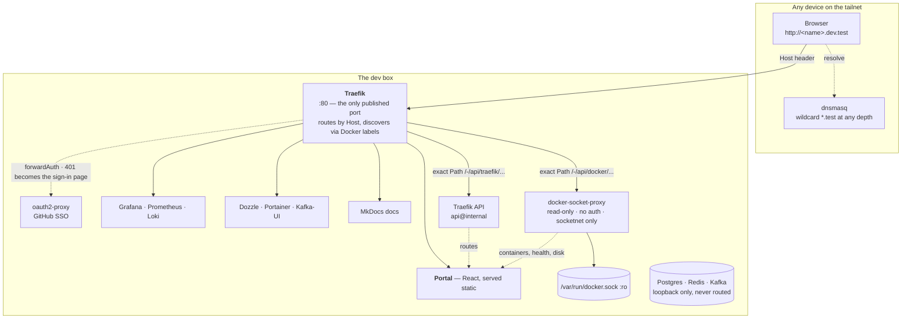

# dev-box

**A self-hosted developer environment on a private WireGuard tailnet.** Docker
Compose stacks for routing, observability, dev data services and management
UIs — fronted by a homepage that discovers what is running instead of listing it.

> **Access model (since 2026-08-08): plain `http://<node-ip>:<port>`.** The
> name-based layer this repo was built around (`*.dev.test` wildcard DNS + SSO)
> is **dormant, not deleted**: `just urls` prints the live port table, and
> [`docs/kb/dns.md`](docs/kb/dns.md) is the re-enable manual. Sections below that
> describe names or SSO document that dormant design.

[](LICENSE)


<p align="center">
  
  <br><br>
  
</p>

---

## What this is

One person's reproducible development box, in git. It provides the things a
project *doesn't* ship — routing, DNS, dashboards, log aggregation, backups — and
it does so for every project on the machine at once. Every non-obvious line in
these compose files carries a comment explaining **why** it is there, usually
because the alternative broke something.

## What this is not

Not a production platform, and not a template to deploy anywhere public:

- **Plaintext HTTP everywhere.** It is safe here only because the transport is a
  WireGuard tailnet. On a LAN or the internet, it is not.
- **Dev credentials.** `.env.example` ships `devpass` / `admin`. Redis has no
  password at all; that is why it binds loopback only.
- **Single node, single user.** Access control is tailnet membership plus one
  shared dev login on the dashboards (the GitHub SSO is parked). There is no HA,
  no TLS, no multi-tenancy, and backups sit on the disk they protect.
- **A helper, not a dependency.** A project keeps its own Postgres so it stays
  self-contained. If Traefik is down, your project still runs — you just lose the
  pretty hostname.

---

## The two ideas worth stealing

### 1. Nothing publishes a port. Everything gets a name.

> **Status: dormant since 2026-08-08.** The wildcard DNS that made these names
> resolve was retired in favour of direct tailnet-IP access, so today services
> *do* publish ports and the labels below route nothing until the split-DNS
> route returns. The design stays documented because the collision problem it
> solves is real, and re-enabling it is a single admin-console change.

Host ports are a flat global namespace with no allocator, so every project reaches
for 3000/8080/5432 and collides with whatever squatted there first — and the
collision surfaces as a bind failure that doesn't name the culprit.

Traefik owns `:80` and routes by `Host` header instead. It is the **only**
container in the repo that publishes a browser-facing port. Names are infinite;
ports are 65535 and everyone picks the same dozen.

Adding a service is two labels and a name — no DNS entry, no port allocation,
nothing restarted:

```yaml
services:
  myapp:
    networks: [default, devnet]      # BOTH — listing networks drops the default
    labels:
      - traefik.enable=true
      - traefik.http.routers.myapp.rule=Host(`myapp.dev.test`)
      - traefik.http.routers.myapp.entrypoints=web
      - traefik.http.routers.myapp.service=myapp
      - traefik.http.services.myapp.loadbalancer.server.port=8080   # container port
networks:
  devnet: { external: true }
```

`http://myapp.dev.test` works immediately, from every device on the tailnet.

The namespace nests, so the hierarchy tells you what owns what:

```
dev.test                        the portal — index of everything
├── grafana.dev.test            stack services sit one level down
├── prometheus.dev.test
├── docs.dev.test
├── traefik.dev.test            check here first when a name 404s
└── <project>.dev.test          one branch per project
    ├── api.<project>.dev.test  a project's own pieces nest under the project,
    └── s3.<project>.dev.test   never at the top level
```

Traefik discovers containers from labels. Processes running on the **host** have
nothing to label, so they are declared in `edge/dynamic/*.yml` — a watched file
provider pointing at `host.docker.internal:<port>`. Same namespace, same SSO, no
published port either. (The host process must bind `0.0.0.0`; `127.0.0.1` is
unreachable from inside a container and the route 502s.)

### 2. The portal discovers what is running. It is never a hand-written list.

The portal — Traefik's catch-all on `:80`; `dev.test` when names are enabled —
is a React 19 + Vite app served as a static build. Its service links navigate by
published port on whichever host you opened it from, so they work identically
via tailnet IP, MagicDNS name or localhost. It renders by joining
**two read-only APIs**, both proxied under its own origin so there is zero CORS:

| Path | Backend | Gives |
|---|---|---|
| `/-/api/traefik/*` | Traefik's `api@internal` | every route, including host processes, and its target |
| `/-/api/docker/containers/json` | `docker-socket-proxy` | ports, health, images, compose labels, mounted volumes |
| `/-/api/docker/system/df` | `docker-socket-proxy` | per-volume / image / container disk sizes |

**Traefik is the skeleton; Docker is enrichment.** Either can die and the page
still renders — that is the design, not a nicety. The join walks
`router → service → server URL → devnet IP → container`, and falls back to the
container's own Traefik labels if the Traefik-side IP is stale.

Containers are then classified with no lookup table anywhere: their
`com.docker.compose.project.config_files` label says whether they belong to this
repo (a stack service) or to a project, and **hostname nesting beats it** — so
`s3.myproject.dev.test` groups under `myproject` even when it is a host process
with no container at all. Optional `dev.portal.*` labels add an icon, a
description or a display name. If the page ever *needs* a label to be correct, the
defaults are wrong.

The test of the whole thesis: **add two Traefik labels to any container and it
appears on the portal within 10 seconds, with no edit to the portal.** Stop a
container and its dot goes red just as fast.

> **The security boundary is the Traefik rule, not the proxy config.**
> `docker-socket-proxy` gates by endpoint *family*, so `CONTAINERS=1` also permits
> `/containers/{id}/json` — whose body contains every container's `Env`, i.e. real
> passwords. What actually prevents that is the router in
> `edge/dynamic/portal-api.yml`, where every rule is an exact `` Path(`…`) `` and
> exactly two Docker endpoints are routed. **Never widen it to `PathPrefix`.**
> The proxy also holds the socket read-only, sets `POST=0`, publishes no port, and
> lives alone with Traefik on a separate `socketnet` — it has no authentication of
> its own, so network reachability *is* authorisation.

---

## Quick start

**Prerequisites**

- Linux with systemd (built and run on WSL2 / Ubuntu 24.04) and Docker Engine 25+
  with the Compose plugin. Traefik must be **≥ v3.6** — older builds hardcode
  Docker API v1.24 and silently load zero routes against a modern daemon.
- [`just`](https://github.com/casey/just), plus `jq` and `curl` for `just doctor`.
- *(only for the dormant name layer)* a resolver that answers `*.test` — see
  [DNS](#dns-how-test-names-resolve) — and a GitHub OAuth App for the parked
  SSO (callback `http://auth.dev.test/oauth2/callback`).

```sh
cp .env.example .env      # fill in DEV_LOGIN_* and WIKI_DB_PASSWORD (OAUTH2_* only for the parked SSO)
just up                   # bring everything up, in dependency order
just urls                 # print every address
just doctor               # health-check the whole box
```

Then open **`http://<this-node's-tailnet-IP>/`** — `just urls` prints every address.

> **Always use `just`, never `docker compose` directly.** `just` loads the root
> `.env` via `set dotenv-load`. `docker compose` looks for a `.env` beside the
> compose file it was handed, finds none, and either falls back to insecure
> defaults or aborts on a required variable.

---

## Repo map

| Path | What lives there |
|---|---|
| `edge/` | **Traefik** — the front door on `:80`: serves the portal catch-all and the `/-/api/*` data plane; Host-name routing is dormant. Also exports Prometheus metrics on an internal entrypoint with no host port. |
| `edge/dynamic/` | Watched file-provider routes for things the Docker provider cannot see: `auth.yml` (the SSO middleware chain), `portal-api.yml` (the portal's read-only data plane), `host-services.yml` and per-project files for host processes. |
| `auth/` | **oauth2-proxy** — GitHub SSO, **parked**; `edge/dynamic/auth.yml` carries the re-enable recipe. |
| `monitoring/` | Prometheus, Grafana, Loki + Promtail, cAdvisor, node-exporter. `provisioning/` wires datasources, dashboards and email alert rules; `dashboards/` holds six provisioned dashboards; `rules/` is for Prometheus rules. |
| `data/postgres/`, `data/redis/`, `data/kafka/` | Each datastore plus its Prometheus exporter. Kafka is single-node KRaft. All three bind **loopback only** and are never routed by name. |
| `mgmt/` | Portainer and Dozzle. |
| `apps/portal-next/` | The live portal at `dev.test` — React 19 + Vite + TypeScript, built by a multi-stage image and served static by nginx. Pages: Overview, Services, Ports, Routes, Topology (a lazy-loaded react-three-fiber 3D rack view). |
| `apps/portal/` | The retired pure-HTML portal, kept as a one-line rollback — **and the owner of `portal-socket-proxy`**, which the live portal still depends on. Do not `compose down` this directory. |
| `apps/docs/` | MkDocs Material rendering every markdown file on the box, kept in sync by an rsync sidecar. Read-only; edits to the source files show up within ~15s. |
| `apps/wiki/` | Wiki.js — superseded by `apps/docs/`; currently stopped, kept until its content is migrated. |
| `host/` | Copies of the host configuration git cannot see: dnsmasq, `daemon.json`, `wsl.conf`, the systemd units, and the Windows keepalive task. Required to rebuild the box. See [`host/README.md`](host/README.md). |
| `scripts/` | `backup.sh` and `doctor.sh`. |
| `justfile` | Every operation. Start here. |

---

## Architecture

_The diagram shows the **full design, including the dormant layer** (wildcard
DNS names, SSO). Live traffic today goes browser → `http://<node-ip>:<port>`
straight to each service, or `:80` for the portal._



Two Docker networks, deliberately:

- **`devnet`** — the shared external network everything joins. Traefik pins its
  discovery to it (`--providers.docker.network=devnet`) so it can never pick the
  wrong container IP from a project-local network.
- **`socketnet`** — holds exactly two containers, Traefik and
  `portal-socket-proxy`. The proxy has no authentication, so keeping the blast
  radius at two members is the control.

### Single sign-on

> **Parked since 2026-08-08** — the OAuth callback is pinned to a name that no
> longer resolves. In its place every dashboard runs its own login with one
> shared dev credential (`DEV_LOGIN_*` in `.env`): Grafana, Portainer, Dozzle,
> Kafka-UI and Prometheus (basic auth, carried by its self-scrape and the
> Grafana datasource too). What follows documents the dormant design.

Services with no login of their own — Dozzle, Kafka-UI, Prometheus, the docs, the
Traefik dashboard and the portal — sit behind GitHub SSO via oauth2-proxy as a
Traefik `forwardAuth` target. The session cookie is scoped to `.dev.test`, so one
sign-in covers all of them, and only one GitHub account is permitted.

Portainer is behind SSO too, because it holds a read-write Docker socket: its UI
exposes container environment variables and container exec, which is root on the
box. Grafana and Wiki.js keep their own logins.

GitHub rather than Google as the provider for one concrete reason: Google rejects
`http://` redirect URIs, which would force TLS, and TLS on `*.dev.test` means
installing a private CA on every device.

---

## The `just` recipes worth knowing

```sh
just up          # everything, in dependency order (edge → auth → monitoring → data → mgmt → apps)
just up-edge     # or bring up one group: up-auth, up-monitoring, up-data, up-mgmt, up-apps
just down        # stop everything, keep the data
just nuke        # stop everything AND delete every volume — destructive, prompts first
just ps          # what is running
just doctor      # containers, Prometheus targets, k8s node, disk/memory, backup freshness
just backup      # what the 03:00 timer runs
just urls        # every address, plus the ssh tunnel command
just logs NAME   # follow a container's logs
just psql        # a psql shell on the dev database
just redis       # a redis-cli shell
just network     # create the devnet + socketnet networks (idempotent; every up- depends on it)
```

`just nuke` sits one keystroke away from `just down` in the recipe list and
deletes all seven data volumes, which is why it is the one recipe that asks for
confirmation.

Bringing up a group is safe and independent: the edge must be up before anything
expects to be routed, and auth before the routers that reference its middleware,
but nothing else has an ordering requirement.

---

## DNS: how `*.test` names resolve

> **Dormant since 2026-08-08:** the tailnet split-DNS route was removed, so no
> client resolves `.test` any more. dnsmasq itself still runs — it is the box's
> own resolver — and everything below becomes true again the moment the route
> is re-added (admin console → DNS → Nameservers → `test` → this node).

A local dnsmasq is authoritative for `.test` and answers a wildcard at **any
depth**, so a brand-new name at any level needs no DNS work at all — only a
Traefik rule.

```conf
# /etc/dnsmasq.d/dev.conf
bind-dynamic                 # not bind-interfaces: the tailnet iface may not exist yet at boot
listen-address=<this-node>   # only the tailnet IP; systemd-resolved owns 127.0.0.53
no-resolv                    # authoritative for .test, forwards nothing
address=/test/<this-node>    # wildcard at ANY depth
domain-needed                # dotless names NXDOMAIN instantly — see below
```

Tailscale **split DNS** (admin console → DNS → Nameservers) then routes `test`
queries to this node, so every device on the tailnet resolves `*.dev.test`
directly. Nothing is published to the LAN or the internet, and the tailnet is
WireGuard, so plain `http://` here is still encrypted in transit. A device that is
not on the tailnet gets `NXDOMAIN` — that is the first thing to check when a name
"stops working".

Three things that are load-bearing here:

- **`.test`, never `.dev`.** `.dev` is a real gTLD and is HSTS-preloaded, so
  browsers force `https://` and plain HTTP never loads. `.test` is reserved by
  RFC 6761, can never become a real TLD, and nothing preloads it.
- **`domain-needed` is not cosmetic.** Without it, a dotless name that leaks out
  of a container into a host process (`tempo`, `redis`, any bare compose service
  name) is forwarded upstream to a resolver that drops it silently rather than
  answering NXDOMAIN. Lookups then hang ~40s each — and since `getaddrinfo` runs
  on libuv's four-thread pool, a handful of them starve *every other lookup in
  the process*. That presents as unrelated database timeouts, which is a very
  expensive way to learn about DNS.
- **`local=/test/`** makes dnsmasq answer AAAA for `.test` with an immediate
  NODATA. A plain `curl http://x.dev.test` that hangs while `curl -4` works
  instantly is always something answering AAAA with silence instead.

Databases are deliberately **not** routed by name. Reach them over SSH:

```sh
ssh -L 5432:localhost:5432 -L 6379:localhost:6379 -L 9092:localhost:9092 \
    <user>@<this-node>.<your-tailnet>.ts.net
```

---

## Backups

`stacks-backup.timer` runs `scripts/backup.sh` at 03:00 daily, keeping the newest
14 of each: the Postgres dump, the Redis snapshot, the Grafana and Portainer
databases, and `.env` — which is gitignored and exists in exactly one place on
earth, so losing it loses every credential on the box.

The script is deliberately **not** `set -e`: one failed service must not skip the
other four. It waits for Postgres to accept connections before dumping, verifies
every artifact is non-empty before keeping it, and exits non-zero if any step
failed. All three of those are scar tissue — it previously produced 20-byte empty
dumps for six days while reporting success, because the timer is
`Persistent=true` and a schedule missed while the box was off fires at the next
boot, which is exactly when Postgres is still starting.

`just doctor` therefore checks backup **age and size**, not existence: a failed
`pg_dumpall` still leaves behind a perfectly valid gzip of nothing.

Backups sit on the same disk they protect. Copying them off the box is not solved.

---

## Things that will catch you

- **The box must stay awake.** WSL2 destroys the VM 60 seconds after the last
  Windows-side client disconnects, taking Docker and every container with it. A
  Windows scheduled task holds it open — see [`host/README.md`](host/README.md).
  `restart: unless-stopped` is inert if the daemon never starts.
- **Traefik's `edge/dynamic` mount goes stale after `git checkout`.** A bind mount
  pins the host inode at container-creation time and checkout recreates
  directories, so Traefik keeps reading an orphaned copy and silently serves its
  last in-memory config — `--providers.file.watch=true` stops meaning anything.
  Fix: `docker compose -f edge/compose.yml up -d --force-recreate`.
- **Listing `networks:` on a service silently drops it off the compose default
  network.** Always `[default, devnet]`, or the service loses its own database.
- **`/etc/resolv.conf` is immutable on purpose.** WSL rewrites it whenever
  Windows' DNS configuration changes. `sudo chattr -i` to edit, `+i` when done.
- **`systemctl reload dnsmasq` does not re-read the config.** SIGHUP re-reads
  `/etc/hosts` and clears the cache, nothing more. A config edit needs a restart.
- **A name that 404s** → the router table is served at
  `http://<node-ip>/-/api/traefik/http/routers`; it shows exactly which routers
  are registered. (`traefik.dev.test` works when names are enabled.)
- **Tunnel pings pong but pages stall, or SSH hangs at key exchange** — the
  large-packet blackhole. Restart tailscaled on the box; recipe in
  [`docs/kb/incidents/2026-08-08-wsl-node-large-packet-blackhole.md`](docs/kb/incidents/2026-08-08-wsl-node-large-packet-blackhole.md).

---

## Deeper docs

- **Docs on `:8085`** (`docs.dev.test` when names are enabled) — MkDocs
  Material, rendering every markdown file on the box, auto-synced.
- [`docs/kb/`](docs/kb/README.md) — the operational knowledge base: topology,
  access paths, runbooks, incident files and the lessons they paid for.
- **The compose files themselves.** Every non-obvious setting has a comment
  explaining what broke without it — `edge/compose.yml`, `auth/compose.yml` and
  `edge/dynamic/portal-api.yml` are the three worth reading in full.
- [`host/README.md`](host/README.md) — the host-level configuration that git
  cannot see, and what each copy is for.

## Contributing, security, licence

This is a personal box published as a reference, so issues and questions are more
welcome than pull requests — but both are read.

- [SECURITY.md](SECURITY.md) — the threat model, and what "safe on a tailnet"
  does and does not mean
- [CONTRIBUTING.md](CONTRIBUTING.md)
- [CODE_OF_CONDUCT.md](CODE_OF_CONDUCT.md)
- [LICENSE](LICENSE) — MIT
