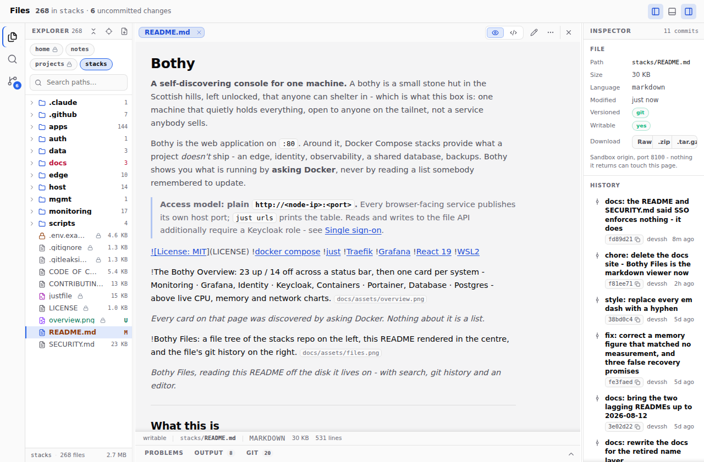
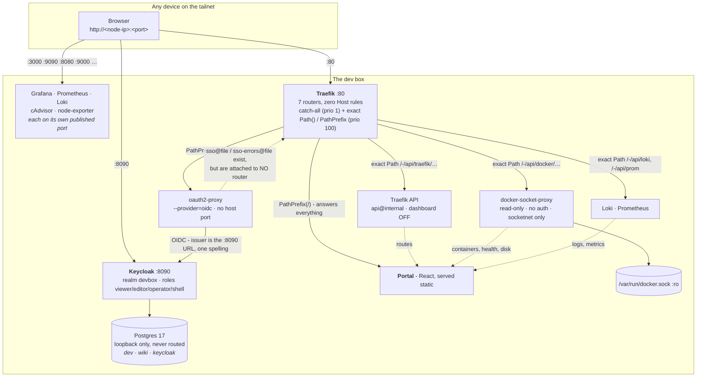

# Bothy

**A self-discovering console for one machine.** A bothy is a small stone hut in
the Scottish hills, left unlocked, that anyone can shelter in - which is what
this box is: one machine that quietly holds everything, open to anyone on the
tailnet, not a service anybody sells.

Bothy is the web application on `:80`. Around it, Docker Compose stacks provide
what a project *doesn't* ship - an edge, identity, observability, a shared
database, backups. Bothy shows you what is running by **asking Docker**, never
by reading a list somebody remembered to update.

> **Access model: plain `http://<node-ip>:<port>`.** Every browser-facing
> service publishes its own host port; `just urls` prints the table. Reads and
> writes to the file API additionally require a Keycloak role - see
> [Single sign-on](#single-sign-on).

[](LICENSE)


_Every card on that page was discovered by asking Docker. Nothing about it is a list._



_Bothy Files, reading this README off the disk it lives on - with search, git history and an editor._

---

## What this is

One person's reproducible development box, in git. It provides the things a
project *doesn't* ship - an edge, identity, dashboards, log aggregation, a shared
database, backups - and it does so for every project on the machine at once.
Every non-obvious line in these compose files carries a comment explaining **why**
it is there, usually because the alternative broke something.

It does **not** provide routing-by-name or DNS. Every browser-facing service
publishes its own port instead; the section below says why.

## What this is not

Not a production platform, and not a template to deploy anywhere public:

- **Plaintext HTTP everywhere.** It is safe here only because the transport is a
  WireGuard tailnet. On a LAN or the internet, it is not.
- **Dev credentials.** `.env.example` ships placeholders (`changeme`, `admin`)
  and every one of them is meant to be replaced. A missing `POSTGRES_PASSWORD`
  now aborts rather than silently defaulting - the fallback was removed after the
  superuser password on the live box was found to still be the published
  placeholder.
- **Single node, single user.** Access control is tailnet membership, plus one
  shared dev login on the dashboards, plus Keycloak roles on the one tier that
  can write - see [Single sign-on](#single-sign-on). There is no HA, no TLS, no
  multi-tenancy, and backups sit on the disk they protect.
- **A helper, not a dependency.** A project keeps its own Postgres so it stays
  self-contained. If the edge is down, your project still runs on its own port -
  the only thing you lose is Bothy's view of it.

---

## The three ideas worth stealing

### 1. The portal discovers what is running. It is never a hand-written list.

The portal - Traefik's catch-all on `:80` - is a React 19 + Vite app served as a
static build. Its service links navigate by
published port on whichever host you opened it from, so they work identically
via tailnet IP, MagicDNS name or localhost. It renders by joining
**two read-only APIs**, both proxied under its own origin so there is zero CORS:

| Path | Backend | Gives |
|---|---|---|
| `/-/api/traefik/*` | Traefik's `api@internal` | every route, including host processes, and its target |
| `/-/api/docker/containers/json` | `docker-socket-proxy` | ports, health, images, compose labels, mounted volumes |
| `/-/api/docker/system/df` | `docker-socket-proxy` | per-volume / image / container disk sizes |

**Traefik is the skeleton; Docker is enrichment.** Either can die and the page
still renders - that is the design, not a nicety. The join walks
`router → service → server URL → devnet IP → container`, and falls back to the
container's own Traefik labels if the Traefik-side IP is stale.

Containers are then classified with no lookup table anywhere: their
`com.docker.compose.project.config_files` label says whether they belong to this
repo (a stack service) or to a project. Optional `dev.portal.*` labels add an
icon, a description or a display name - one label names a whole compose project,
which is how `Edge · Traefik` and `Identity · Keycloak` get their titles. If the
page ever *needs* a label to be correct, the
defaults are wrong.

The test of the whole thesis: **start any container and it appears on the portal
within 10 seconds, with no edit to the portal.** Stop it and its dot goes red just
as fast.

> **The security boundary is the Traefik rule, not the proxy config.**
> `docker-socket-proxy` gates by endpoint *family*, so `CONTAINERS=1` also permits
> `/containers/{id}/json` - whose body contains every container's `Env`, i.e. real
> passwords. What actually prevents that is the router in
> `edge/dynamic/portal-api.yml`, where every rule is an exact `` Path(`…`) `` and
> exactly two Docker endpoints are routed. **Never widen it to `PathPrefix`.**
> The proxy also holds the socket read-only, sets `POST=0`, publishes no port, and
> lives alone with Traefik on a separate `socketnet` - it has no authentication of
> its own, so network reachability *is* authorisation.

### 2. A service with no auth of its own is protected by exactly one thing: who can reach it

The socket proxy taught this and the editor tier is built on it. `portal-files`
holds read-write bind mounts on two git repositories and authenticates nobody. It
publishes **no host port** and sits on a network holding exactly two containers -
itself and Traefik. Authorisation happens at the edge, in a `forwardAuth`
middleware; anything that can reach the service directly has already bypassed it.

That single sentence decides the layout: three networks, each holding the minimum
that can talk to a thing worth protecting.

| Network | Holds | Because |
|---|---|---|
| `socketnet` | traefik + the socket proxy | the proxy has no auth, and the socket is root-equivalent |
| `filesnet` | traefik + the editor tier | read-write handles on the repos |
| `devnet` | everything else (~20 containers) | nothing here is a boundary |

Put either of the first two on `devnet` and about twenty containers - including
third-party images - inherit the capability. Nothing would warn you; the service
would work perfectly.

### 3. Make one function own the walk, so the security check is not something a caller has to remember

The file API's `safepath.collect()` is the only way the application can learn a
set of paths. It applies the deny rules, resolves every path, refuses symlinks and
opens files safely - so a *new* endpoint gets those properties by calling it,
rather than by its author remembering to.

This was learned the expensive way twice. First a listing that did its own walk
paid for 30,093 refused files to serve 3,474. Then, when full-text search was
added, the same shortcut would have returned a matching **line** out of `.env` -
the deny-list would still have been correct, and the secret would still have been
on screen. `checks/search_denied.py` plants a credential-shaped token in three
kinds of denied file and requires that only the served one comes back.

The general form: **if a rule can be forgotten, it will be. Put it somewhere it
cannot be skipped, then write the test that proves it was not.**

---

## Quick start

**Prerequisites**

- Linux with systemd (built and run on WSL2 / Ubuntu 24.04) and Docker Engine 25+
  with the Compose plugin. Traefik must be **≥ v3.6** - older builds hardcode
  Docker API v1.24 and silently load zero routes against a modern daemon.
- [`just`](https://github.com/casey/just), plus `jq` and `curl` for `just doctor`.
- Nothing else. No DNS to configure and no account on anyone else's server:
  identity is a local Keycloak in a container.

```sh
cp .env.example .env      # nothing to fill in - see below
just up                   # bring everything up, in dependency order
just urls                 # print every address
just doctor               # health-check the whole box
```

**There is nothing to edit in `.env` before the first `just up`.** The five
credentials the stack actually uses — the two database passwords, the SSO cookie
secret, the OIDC client secret and your login password — are **generated** by
`just bootstrap`, which `just up` runs for you. It prints which keys it wrote,
never their values, and never touches a value you set yourself.

Two things you may still want to set, neither of which blocks a first start:

| Key | Why |
|---|---|
| `BOX_IP` | The address this box answers on. Left alone, Bothy asks `tailscale` and falls back to `127.0.0.1` — which works, but only from this machine. **Keycloak's issuer is built from it**, so changing it later means re-running `just up-auth`. |
| `DEV_LOGIN_USER` | Your login, `dev@example.com` by default. It must be an email address: Keycloak logs in by email. |

Your password is `DEV_LOGIN_PASSWORD` in `.env`. **Back that file up** — the
generated secrets are not recoverable, and `POSTGRES_PASSWORD` and
`KEYCLOAK_DB_PASSWORD` are baked into their database volumes at first start.

Then open **`http://<this-node's-tailnet-IP>/`** - `just urls` prints every address.

> **Always use `just`, never `docker compose` directly.** `just` loads the root
> `.env` via `set dotenv-load`. `docker compose` looks for a `.env` beside the
> compose file it was handed, finds none, and either falls back to insecure
> defaults or aborts on a required variable.

---

## Repo map

| Path | What lives there |
|---|---|
| `edge/` | **Traefik** on `:80`: the portal catch-all, the `/-/api/*` data plane, and the editor tier's role-gated routes. No Host-name routing and no dashboard (`--api=true`, never `--api.dashboard=true` - it served the merged config, credentials included). Exports Prometheus metrics on an internal entrypoint with no host port. |
| `edge/dynamic/` | Watched file-provider routes: `portal-api.yml` (the portal's read-only data plane - the security boundary, read it in full), `portal-files.yml` (the editor tier's three role-gated routers), `auth.yml` (the `sso@file` / `sso-errors@file` middlewares and the host-less `` PathPrefix(`/oauth2/`) `` router), `project.example.yml` (the annotated template, commented out on purpose). |
| `auth/` | **Keycloak 26.7.1 + oauth2-proxy** - the local identity layer. Keycloak publishes `:8090` and stores its data in the shared Postgres under its own `keycloak` role; oauth2-proxy runs `--provider=oidc` against the `devbox` realm and publishes no port. Enforces on the editor tier; see [Single sign-on](#single-sign-on). |
| `monitoring/` | Prometheus, Grafana, Loki + Promtail, cAdvisor, node-exporter. `provisioning/` wires datasources, dashboards and email alert rules; `dashboards/` holds six provisioned dashboards; `rules/` is for Prometheus rules. |
| `data/postgres/` | Postgres 17 plus `postgres-exporter`. Binds **loopback only**. In active use - the dev database and Keycloak both live here. |
| `data/redis/`, `data/kafka/` | **Retired** - both measured completely idle (zero keys, zero topics) and removed. The compose files are kept so `just down` and `just nuke` still clean up an older deployment; `just up-data` no longer starts them, and their volumes are gone. |
| `apps/portal-next/` | The live portal on `:80` - React 19 + Vite + TypeScript, built by a multi-stage image and served static by nginx. Owns `portal-next-fallback`, the catch-all. Pages: Overview, Services, Ports, Routes, Topology (a lazy-loaded react-three-fiber 3D rack view). |
| `apps/bothy/` | The one compose project over Bothy's three tiers, via `include:`. Also **owns `portal-socket-proxy`** - the read-only Docker socket the portal's `/-/api/docker` data plane goes through. It moved here on 2026-08-18 when `apps/portal/`, which existed only to hold it, was deleted. |
| `apps/portal-files/` | The editor tier behind Bothy Files - the read/write file API over the stacks repo, `~/claude-notes` and `~/projects`, with full-text search. No published port; reached only through the edge. |
| `host/` | Copies of the host configuration git cannot see: dnsmasq, `daemon.json`, `wsl.conf`, the systemd units, and the Windows keepalive task. Required to rebuild the box. See [`host/README.md`](host/README.md). |
| `scripts/` | `backup.sh` and `doctor.sh`. |
| `justfile` | Every operation. Start here. |

---

## Architecture

_As it actually is, verified against the live router table. Traffic goes browser →
`http://<node-ip>:<port>` straight to each service; only the portal, its data
plane and the `/oauth2/` sign-in endpoints pass through Traefik._



Verified against the live router table: **10 routers, zero `Host()` rules.** The
count moves as tiers are added; the zero is the invariant, and `just verify`
asserts it.

Keycloak and oauth2-proxy **enforce** on the editor tier's three routers; the
dotted line above is a control there and a capability everywhere else.

Three Docker networks, deliberately - each holding the minimum that can reach a
thing worth protecting:

- **`devnet`** - the shared external network everything joins. Traefik pins its
  discovery to it (`--providers.docker.network=devnet`) so it can never pick the
  wrong container IP from a project-local network.
- **`socketnet`** - holds exactly two containers, Traefik and
  `portal-socket-proxy`. The proxy has no authentication, so keeping the blast
  radius at two members is the control.
- **`filesnet`** - holds exactly two, Traefik and `portal-files`. That service has
  read-write handles on two git repositories and no auth of its own, so the same
  rule applies with a higher stake.

### Single sign-on

**Status: enforcing, on the tier that can change things.** Keycloak issues the
roles, oauth2-proxy answers Traefik's `forwardAuth`, and three routers require a
role today. It is deliberately not yet on the dashboards - see *Why the split*
below.

    Traefik --forwardAuth--> oauth2-proxy --OIDC--> Keycloak

| Piece | State |
|---|---|
| Keycloak 26.7.1 | Running, published on host port **8090**, admin console at `/admin` |
| Keycloak's database | The **existing shared Postgres**, under its own `keycloak` role and database, created by an idempotent one-shot on every `just up-auth` |
| oauth2-proxy 7.15.3 | Running with `--provider=oidc` (was `--provider=github`), no host port |
| Realm `devbox` | Flat, **non-composite** roles `viewer`, `editor`, `operator`, `shell`, and one user |
| The `shell` role | Deliberately granted to nobody. It means an arbitrary terminal, so it must never be reachable by holding one of the other three - which is also why none of the four are composite |

**What a role actually gates today**, from `edge/dynamic/portal-files.yml`:

| Router | Requires | Covers |
|---|---|---|
| `portal-files-read` | `viewer` | `/roots` `/tree` `/read` `/search` `/history` `/repos` `/status` `/git/diff` |
| `portal-files-download` | `viewer` | `/raw` `/archive`, on the `:8100` sandbox entrypoint only |
| `portal-files-write` | `editor` | `/write` |

Everything else on the box - Grafana and Prometheus - still runs
its own login on one shared dev credential (`DEV_LOGIN_*` in `.env`). Postgres is
loopback-only and unrouted. So "SSO is running" does **not** mean "everything is
behind SSO"; it means the write tier is, and nothing else is yet.

**Why the split.** Attaching auth is the step that can lock you out, and the
tools you would use to unlock it - the portal, Grafana - are the very
things you would have just put behind the broken login. So the middlewares were
defined first, then proven against the one tier where the cost of being wrong is
highest (a service holding read-write handles on two git repos), and only then
considered for anything else. Rolling outward from there is a decision, not a
backlog item.

The role requirement lives in the **middleware**, not in the service:
`sso-viewer` and `sso-editor` are identical but for one word in the URL
(`?allowed_groups=`). That is the property that makes the design worth having -
adding an `operator` tier is four lines of YAML, not another container. The
service itself authenticates nobody, which is why it must never leave its own
network: reachability *is* authorisation there.

Verified before it was built, with a role the user does **not** hold:
`allowed_groups=editor` → 202, `allowed_groups=shell` → 403,
`allowed_groups=<junk>` → 403. It fails closed. `just files-check` re-runs that
probe, so the property is tested rather than assumed.

To require a login on a further router, add **both, in this order**:
`middlewares: [sso-errors@file, sso@file]`. Reversed, a signed-out user gets a
blank 401 instead of a sign-in page.

**Why Keycloak rather than GitHub.** The previous design used GitHub as the
identity provider. It worked, but identity came from an account on someone
else's server, it could only ever answer "is this one specific GitHub user", and
there was nowhere to put the notion of a *role*. Keycloak owns the users, the
roles and the login flow locally, so authorisation becomes configuration in this
repo (`auth/realm-devbox.json`) instead of a checkbox on github.com - and it
survives the box being offline from the internet. The GitHub callback also had a
single-point dependency on a DNS name; an IP:port callback depends on nothing.

**The one spelling rule.** Keycloak re-advertises its own address: whatever
`KC_HOSTNAME` says becomes the `issuer` in the discovery document and inside
every token, and oauth2-proxy independently checks that issuer against its
`--oidc-issuer-url`. If the two disagree by so much as a port, the symptom is
not an error - it is an infinite redirect loop. So `http://${BOX_IP}:8090`
appears exactly once as a value and is used by the browser *and* by
oauth2-proxy; the internal shortcut `http://keycloak:8080` is deliberately not
used anywhere in the OIDC config, because a second spelling is the bug.

**Cookies, and why there is no cookie domain.** There is none, and none is
wanted. Every service is a different *port* on the same host, and cookies ignore
the port, so the default host-only cookie on
`${BOX_IP}` is already sent to `:3000`, `:9090`, `:8080` and the rest: single
sign-on across the whole box falls out for free. `--whitelist-domain` is still
needed, with the `:*` all-ports wildcard, because it governs the `?rd=`
return-to URL and *that* does carry a port.

Until something is actually attached, every dashboard runs its own login with
one shared dev credential (`DEV_LOGIN_*` in `.env`): Grafana and Prometheus
(basic auth, carried by its self-scrape and the Grafana datasource too). Postgres
is loopback-only and unrouted.

That list got shorter on 2026-08-18 rather than better-defended: Portainer and
Dozzle were deleted, so two of the four dashboards that needed a login are gone.

> **A general warning that outlived the design it shipped with.** Prometheus'
> basic-auth credential is injected by a Traefik `customRequestHeaders`
> middleware so the portal can query it. That credential was once readable by
> anyone on the tailnet, because the Traefik dashboard served
> `api@internal` unauthenticated and `/api/rawdata` dumps the merged config
> verbatim. **A headers middleware hides a secret from the browser, not from the
> config dump.** The dashboard router was deleted and `--api.dashboard=true`
> became `--api=true` - the API itself must stay on, because the portal's
> `/-/api/traefik/*` routes use `api@internal`.

Two dead ends recorded so nobody pays for them twice:

- **A `"_comment"` key in `realm-devbox.json` crashloops Keycloak.** JSON has no
  comments and Keycloak rejects unknown fields outright. The reasoning that would
  have been inline lives in `auth/compose.yml` instead.
- **A doubled brace anywhere in `edge/dynamic/auth.yml`, including inside a
  comment, silently voids the whole file.** Traefik renders every file in that
  directory as a Go template before parsing the YAML, and it does not skip
  comments. The file on disk looks perfect while Traefik loads no routers and no
  middlewares from it.

---

## The `just` recipes worth knowing

```sh
just up          # everything, in dependency order (edge → auth → monitoring → data → mgmt → apps)
just up-edge     # or bring up one group: up-auth, up-monitoring, up-data, up-mgmt, up-apps
just down        # stop everything, keep the data
just nuke        # stop everything AND delete every volume - destructive, prompts first
just ps          # what is running
just doctor      # containers, Prometheus targets, disk/memory, backup freshness
just backup      # what the 03:00 timer runs
just urls        # every address, plus the ssh tunnel command
just logs NAME   # follow a container's logs
just psql        # a psql shell on the dev database
just network     # create the devnet + socketnet networks (idempotent; every up- depends on it)
```

`just redis` was **removed** with Redis itself. A recipe that can
only ever fail looks like breakage, so it is gone rather than left pointing at a
container that does not exist. `just doctor` prints minikube's absence as a
third state, `dim` - deliberately switched off, not broken - for the same
reason: if every retirement reads as a fault, the report cries wolf until
nobody reads it.

`just nuke` sits one keystroke away from `just down` in the recipe list, which is
why it is the one recipe that asks for confirmation. It still calls `down -v` on
the retired Redis and Kafka compose files, so it cleans up an older deployment
that still has those volumes.

Bringing up a group is safe and independent: the edge must be up before anything
expects to be routed, and auth before any router that references its middleware
(no router does yet), but nothing else has an ordering requirement.

---

## Two traps this box still has

The `.test` name layer is gone, but two of its hazards outlived it, and both cost
real debugging time.

**A 200 proves nothing about routing.** The portal's catch-all `` PathPrefix(`/`) ``
answers *every* unmatched request on `:80` with its own HTML - from any hostname,
from the bare IP, and for any path no other rule matched. So a service you believe
you routed can be dead while `curl` reports a cheerful 200 and a page full of
someone else's markup. It is the most convincing false positive available on this
machine. **Assert on content, never on a status code** - which is exactly what
`just verify` does.

**A dotless hostname in a host process is a landmine.** dnsmasq runs with
`domain-needed`, and that is not cosmetic. Without it, a bare compose service name
(`tempo`, `redis`) leaking out of a container into a host process is forwarded to
an upstream resolver that drops it silently instead of answering NXDOMAIN. Lookups
hang ~40s each - and since `getaddrinfo` runs on libuv's four-thread pool, a
handful of them starve *every other lookup in the process*. It presents as
unrelated database timeouts, which is a very expensive way to learn about DNS.

The full dnsmasq configuration, the `.test`-not-`.dev` reasoning (`.dev` is a real
HSTS-preloaded gTLD, so plain HTTP never loads) and the split-DNS history are in
[`docs/kb/`](docs/kb/README.md).

Databases are deliberately not routed at all. Reach Postgres over SSH:

```sh
ssh -L 5432:localhost:5432 <user>@<this-node>.<your-tailnet>.ts.net
```

---

## Backups

`stacks-backup.timer` runs `scripts/backup.sh` at 03:00 daily, keeping the newest
14 of each: the Postgres dump - which carries Keycloak's realm,
users and roles as well as the dev database - the Grafana database, and `.env`, which is gitignored and exists in exactly one place on
earth, so losing it loses every credential on the box. Its Redis step still runs
and now always reports "redis not running - skipped", because Redis is gone.

The script is deliberately **not** `set -e`: one failed service must not skip the
others. It waits for Postgres to accept connections before dumping, verifies
every artifact is non-empty before keeping it, and exits non-zero if any step
failed. All three of those are scar tissue - it previously produced 20-byte empty
dumps for six days while reporting success, because the timer is
`Persistent=true` and a schedule missed while the box was off fires at the next
boot, which is exactly when Postgres is still starting.

`just doctor` therefore checks backup **age and size**, not existence: a failed
`pg_dumpall` still leaves behind a perfectly valid gzip of nothing.

Backups sit on the same disk they protect. Copying them off the box is not solved.

---

## Things that will catch you

- **The box must stay awake.** WSL2 destroys the VM 60 seconds after the last
  Windows-side client disconnects, taking Docker and every container with it. A
  Windows scheduled task holds it open - see [`host/README.md`](host/README.md).
  `restart: unless-stopped` is inert if the daemon never starts.
- **Traefik's `edge/dynamic` mount goes stale after `git checkout`.** A bind mount
  pins the host inode at container-creation time and checkout recreates
  directories, so Traefik keeps reading an orphaned copy and silently serves its
  last in-memory config - `--providers.file.watch=true` stops meaning anything.
  Fix: `docker compose -f edge/compose.yml up -d --force-recreate`.
- **Listing `networks:` on a service silently drops it off the compose default
  network.** Always `[default, devnet]`, or the service loses its own database.
- **`/etc/resolv.conf` is immutable on purpose.** WSL rewrites it whenever
  Windows' DNS configuration changes. `sudo chattr -i` to edit, `+i` when done.
- **`systemctl reload dnsmasq` does not re-read the config.** SIGHUP re-reads
  `/etc/hosts` and clears the cache, nothing more. A config edit needs a restart.
- **A route that misbehaves** → the router table is served at
  `http://<node-ip>/-/api/traefik/http/routers`; it shows exactly which routers
  are registered. There is no Traefik dashboard to check instead - it was deleted
  because it leaked a credential.
- **A `Host()` rule added today registers as `enabled` and matches nothing.**
  There is no name layer. Publish a port, or use a host-less exact
  `` Path(`…`) `` rule - `edge/dynamic/project.example.yml` is the template.
- **A doubled brace anywhere in `edge/dynamic/*.yml` voids the whole file,
  comments included.** Traefik renders those files as Go templates before parsing
  the YAML. `docker inspect -f` format strings are the usual way in; use the `jq`
  form instead.
- **`just urls` is not an authoritative port registry.** It lists the *stack's*
  ports; a project's claims live in its own `project.dev.yml`, and nothing
  reconciles the two. Keycloak was once published on `:8083`, which a stopped
  project had already declared - the collector TCP-probed the declared port, found
  something listening, and reported a service nobody had started as up. It moved
  to `:8090`. Check **both** `ss -ltn` and the
  project manifests before publishing a port.
- **"SSO is running" does not mean "SSO is protecting this."** Defining a
  middleware is not attaching it. Today three routers carry a role requirement and
  every other service carries its own login instead. Confirm with the router
  table, not with `docker ps`.
- **Tunnel pings pong but pages stall, or SSH hangs at key exchange** - the
  large-packet blackhole. Restart tailscaled on the box; recipe in
  [`docs/kb/incidents/2026-08-08-wsl-node-large-packet-blackhole.md`](docs/kb/incidents/2026-08-08-wsl-node-large-packet-blackhole.md).

---

## Deeper docs

- **Bothy Files** - <http://100.117.176.85/#/files>. Every markdown file on the
  box, rendered, searchable and editable, read straight from disk.
- [`docs/kb/`](docs/kb/README.md) - the operational knowledge base: topology,
  access paths, runbooks, incident files and the lessons they paid for.
- **The compose files themselves.** Every non-obvious setting has a comment
  explaining what broke without it - `edge/compose.yml`, `auth/compose.yml`,
  `edge/dynamic/auth.yml` and `edge/dynamic/portal-api.yml` are the four worth
  reading in full. `auth/compose.yml` in particular carries the reasoning that
  could not live inside `auth/realm-devbox.json`, because Keycloak rejects
  unknown JSON keys.
- [`host/README.md`](host/README.md) - the host-level configuration that git
  cannot see, and what each copy is for.

## Contributing, security, licence

This is a personal box published as a reference, so issues and questions are more
welcome than pull requests - but both are read.

- [SECURITY.md](SECURITY.md) - the threat model, and what "safe on a tailnet"
  does and does not mean
- [CONTRIBUTING.md](CONTRIBUTING.md)
- [CODE_OF_CONDUCT.md](CODE_OF_CONDUCT.md)
- [LICENSE](LICENSE) - MIT
