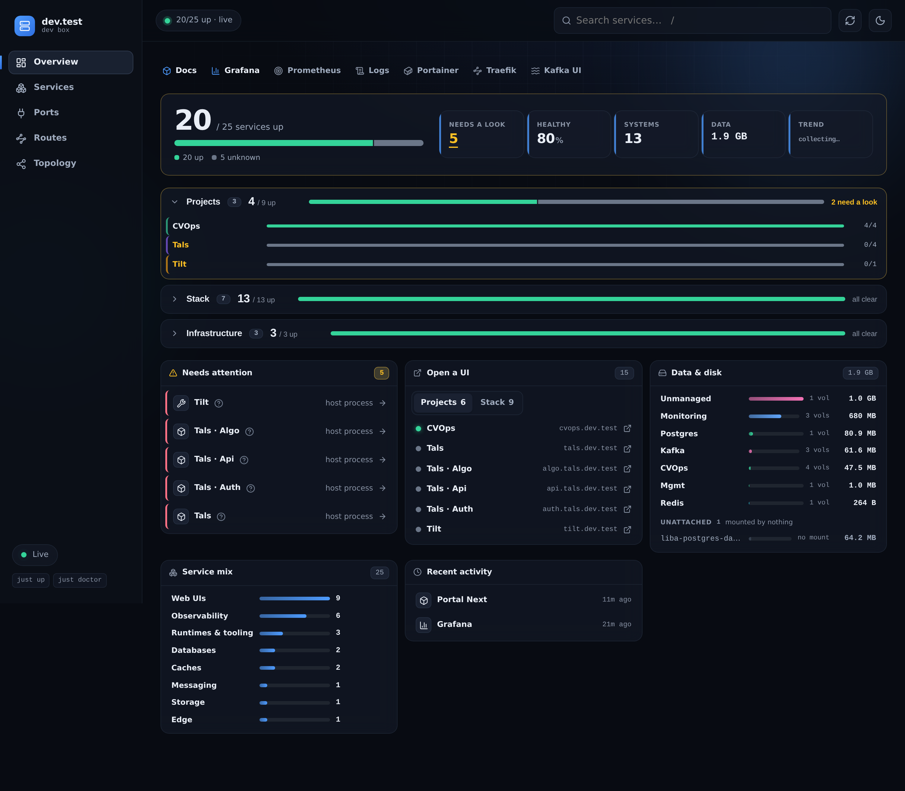
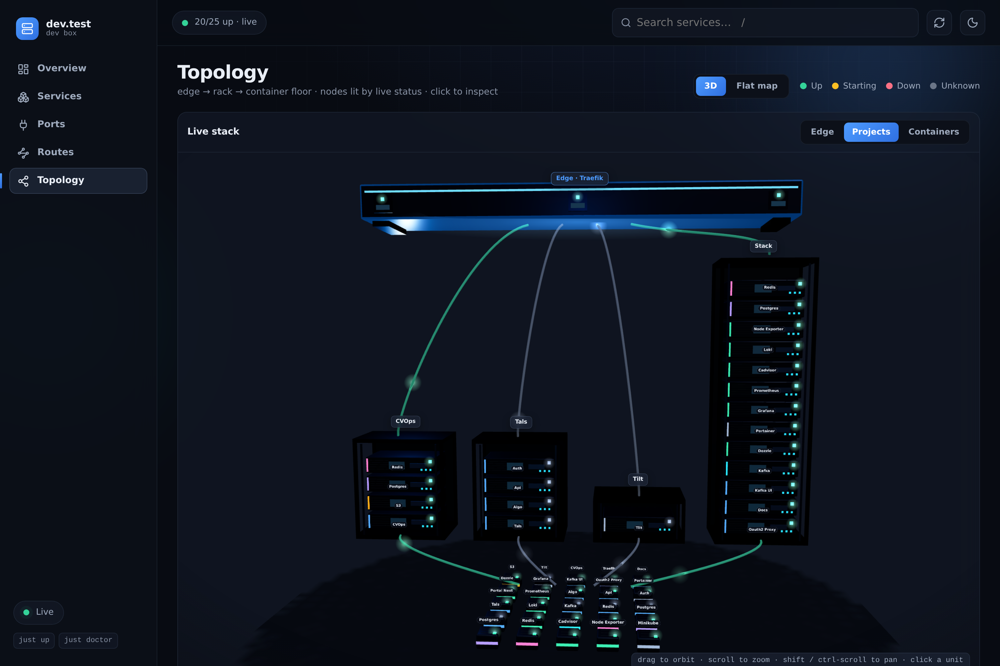
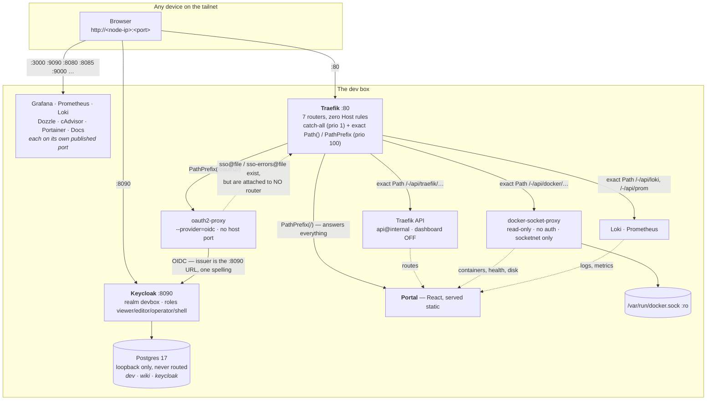

# dev-box

**A self-hosted developer environment on a private WireGuard tailnet.** Docker
Compose stacks for routing, observability, dev data services and management
UIs — fronted by a homepage that discovers what is running instead of listing it.

> **Access model: plain `http://<node-ip>:<port>`.** The `*.dev.test` wildcard-DNS
> layer this repo was built around went dormant on 2026-08-08 and was **deleted on
> 2026-08-12** — every `Host()` router removed, none left in the router table.
> `just urls` prints the live port table. Sections below that describe names
> document a **retired** design, kept because the problem it solved is real;
> [`docs/kb/dns.md`](docs/kb/dns.md) records what would be involved in rebuilding
> it, which is considerably more than flipping a switch.
>
> **SSO was not retired with it — it was rebuilt on IP.** Since 2026-08-12
> identity is a local Keycloak on `:8090` with oauth2-proxy in front, replacing
> GitHub. It is running and it **enforces nothing yet**: the middlewares exist,
> no router uses them. See [Single sign-on](#single-sign-on).

[](LICENSE)


<p align="center">
  
  <br><br>
  
</p>

---

## What this is

One person's reproducible development box, in git. It provides the things a
project *doesn't* ship — routing, DNS, dashboards, log aggregation, backups — and
it does so for every project on the machine at once. Every non-obvious line in
these compose files carries a comment explaining **why** it is there, usually
because the alternative broke something.

## What this is not

Not a production platform, and not a template to deploy anywhere public:

- **Plaintext HTTP everywhere.** It is safe here only because the transport is a
  WireGuard tailnet. On a LAN or the internet, it is not.
- **Dev credentials.** `.env.example` ships placeholders (`changeme`, `admin`)
  and every one of them is meant to be replaced. On 2026-08-12 the Postgres
  superuser password was found to still be the published placeholder on the live
  box; it was rotated and the insecure compose fallback removed, so a missing
  `POSTGRES_PASSWORD` now aborts instead of silently defaulting.
- **Single node, single user.** Access control is tailnet membership plus one
  shared dev login on the dashboards. A Keycloak-based SSO exists as of
  2026-08-12 but **enforces nothing yet** — see [Single sign-on](#single-sign-on).
  There is no HA, no TLS, no multi-tenancy, and backups sit on the disk they
  protect.
- **A helper, not a dependency.** A project keeps its own Postgres so it stays
  self-contained. If Traefik is down, your project still runs — you just lose the
  pretty hostname.

---

## The two ideas worth stealing

### 1. Nothing publishes a port. Everything gets a name. — RETIRED 2026-08-12

> **This idea is no longer implemented here.** It is kept, honestly labelled,
> because the problem it solves is real and because how it ended is the more
> useful half of the story.

Host ports are a flat global namespace with no allocator, so every project reaches
for 3000/8080/5432 and collides with whatever squatted there first — and the
collision surfaces as a bind failure that doesn't name the culprit.

The answer was to have Traefik own `:80` and route by `Host` header, making it the
**only** container in the repo publishing a browser-facing port. Names are
infinite; ports are 65535 and everyone picks the same dozen. Adding a service was
two labels and a name — no DNS entry, no port allocation, nothing restarted — and
the namespace nested (`s3.<project>.dev.test` under `<project>.dev.test`) so the
hierarchy told you what owned what. A wildcard `address=/test/` in dnsmasq meant a
new name at any depth needed no DNS work at all.

**Why it is gone.** Two steps:

1. **2026-08-08** — the tailnet split-DNS route was removed, so no client could
   resolve `.test` any more. The routers survived, labelled "dormant, re-enable
   later".
2. **2026-08-12** — "dormant" proved more expensive than it saved. Dead routers
   are configuration that *looks* live: they taught every new service the wrong
   pattern, they needed a caveat in every document, and one of them — the Traefik
   dashboard — was quietly serving `api@internal` unauthenticated, where
   `/api/rawdata` dumped the merged config **including a live
   `Authorization: Basic` header** that a `customRequestHeaders` middleware
   injected for Prometheus. They were deleted.

Deleting them cost nothing measurable. The router table went from **22 routers to
6** — four host-less exact-`Path()` routes for the portal's `/-/api/*` data plane,
the portal's catch-all, and Traefik's internal metrics route — with **zero `Host()`
rules remaining**. Nothing became unreachable, because every browser-facing service
had kept its published port all along, and the verification harness passed
afterwards. The only functional loss was the Traefik dashboard UI.

It is **7** as of later the same day: the Keycloak work added
`oauth2-endpoints@file`, a `` PathPrefix(`/oauth2/`) `` route at priority 100. Still
zero `Host()` rules — that is the invariant worth checking, not the count.

**What replaced it.** A browser-facing service publishes a host port and is reached
at `http://<node-ip>:<port>`; `just urls` prints the table and is the only
allocator there is. Host processes bind `0.0.0.0` on their own port. If a service
genuinely needs a Traefik route, the one supported shape is a **host-less exact
`` Path(`…`) ``** rule at priority 100 — see `edge/dynamic/project.example.yml`
for the annotated template and `edge/dynamic/portal-api.yml` for the live example.
**Do not write a `Host()` rule:** with no name layer it registers as `enabled` and
then matches nothing, forever, which is worse than an error.

The lesson worth stealing is the one that survived: **either keep a layer working
or delete it — parked configuration is the expensive middle.**

### 2. The portal discovers what is running. It is never a hand-written list.

The portal — Traefik's catch-all on `:80`, and since 2026-08-12 the only non-API
router on the box — is a React 19 + Vite app served as a static build. Its service links navigate by
published port on whichever host you opened it from, so they work identically
via tailnet IP, MagicDNS name or localhost. It renders by joining
**two read-only APIs**, both proxied under its own origin so there is zero CORS:

| Path | Backend | Gives |
|---|---|---|
| `/-/api/traefik/*` | Traefik's `api@internal` | every route, including host processes, and its target |
| `/-/api/docker/containers/json` | `docker-socket-proxy` | ports, health, images, compose labels, mounted volumes |
| `/-/api/docker/system/df` | `docker-socket-proxy` | per-volume / image / container disk sizes |

**Traefik is the skeleton; Docker is enrichment.** Either can die and the page
still renders — that is the design, not a nicety. The join walks
`router → service → server URL → devnet IP → container`, and falls back to the
container's own Traefik labels if the Traefik-side IP is stale.

Containers are then classified with no lookup table anywhere: their
`com.docker.compose.project.config_files` label says whether they belong to this
repo (a stack service) or to a project, and **hostname nesting beats it** — so
`s3.myproject.dev.test` grouped under `myproject` even when it was a host process
with no container at all. (Since the name layer was deleted on 2026-08-12 there are
no hostnames left to nest, so that branch is retained but dormant; classification
falls through to `config_files`.) Optional `dev.portal.*` labels add an icon, a
description or a display name. If the page ever *needs* a label to be correct, the
defaults are wrong.

The test of the whole thesis: **start any container and it appears on the portal
within 10 seconds, with no edit to the portal.** Stop it and its dot goes red just
as fast.

> **The security boundary is the Traefik rule, not the proxy config.**
> `docker-socket-proxy` gates by endpoint *family*, so `CONTAINERS=1` also permits
> `/containers/{id}/json` — whose body contains every container's `Env`, i.e. real
> passwords. What actually prevents that is the router in
> `edge/dynamic/portal-api.yml`, where every rule is an exact `` Path(`…`) `` and
> exactly two Docker endpoints are routed. **Never widen it to `PathPrefix`.**
> The proxy also holds the socket read-only, sets `POST=0`, publishes no port, and
> lives alone with Traefik on a separate `socketnet` — it has no authentication of
> its own, so network reachability *is* authorisation.

---

## Quick start

**Prerequisites**

- Linux with systemd (built and run on WSL2 / Ubuntu 24.04) and Docker Engine 25+
  with the Compose plugin. Traefik must be **≥ v3.6** — older builds hardcode
  Docker API v1.24 and silently load zero routes against a modern daemon.
- [`just`](https://github.com/casey/just), plus `jq` and `curl` for `just doctor`.
- Nothing else. The retired name layer needed a resolver answering `*.test`, and
  the retired GitHub SSO needed an OAuth App on github.com; neither is required
  today. Identity is now local — Keycloak in a container, no internet account
  involved.

```sh
cp .env.example .env      # fill in BOX_IP, DEV_LOGIN_*, POSTGRES_PASSWORD, WIKI_DB_PASSWORD, KEYCLOAK_*
just up                   # bring everything up, in dependency order
just urls                 # print every address
just doctor               # health-check the whole box
```

Then open **`http://<this-node's-tailnet-IP>/`** — `just urls` prints every address.

> **Always use `just`, never `docker compose` directly.** `just` loads the root
> `.env` via `set dotenv-load`. `docker compose` looks for a `.env` beside the
> compose file it was handed, finds none, and either falls back to insecure
> defaults or aborts on a required variable.

---

## Repo map

| Path | What lives there |
|---|---|
| `edge/` | **Traefik** on `:80`: serves the portal catch-all and the `/-/api/*` data plane, and nothing else — Host-name routing was deleted 2026-08-12, as was the dashboard (`--api=true`, not `--api.dashboard=true`). Also exports Prometheus metrics on an internal entrypoint with no host port. |
| `edge/dynamic/` | Watched file-provider routes: `portal-api.yml` (the portal's read-only data plane — the security boundary, read it in full), `project.example.yml` (the annotated template, entirely commented out on purpose), `auth.yml` (live again 2026-08-12 — defines the `sso@file` / `sso-errors@file` middlewares and the host-less `` PathPrefix(`/oauth2/`) `` router, but **attaches the middlewares to no router**), `host-services.yml` (now declares no routes). |
| `auth/` | **Keycloak 26.7.1 + oauth2-proxy** — the local identity layer, running since 2026-08-12. Keycloak publishes `:8090` and stores its data in the shared Postgres under its own `keycloak` role; oauth2-proxy runs `--provider=oidc` against the `devbox` realm and publishes no port. **Nothing is enforced yet.** See [Single sign-on](#single-sign-on). |
| `monitoring/` | Prometheus, Grafana, Loki + Promtail, cAdvisor, node-exporter. `provisioning/` wires datasources, dashboards and email alert rules; `dashboards/` holds six provisioned dashboards; `rules/` is for Prometheus rules. |
| `data/postgres/` | Postgres 17 plus `postgres-exporter`. Binds **loopback only**. In active use — the dev database, Wiki.js and Keycloak all live here. |
| `data/redis/`, `data/kafka/` | **Retired 2026-08-12** as measured-idle — see [What was retired](#what-was-retired-2026-08-12). The compose files are kept so `just down` and `just nuke` still clean up an older deployment; `just up-data` no longer starts them. |
| `mgmt/` | Portainer and Dozzle. |
| `apps/portal-next/` | The live portal on `:80` — React 19 + Vite + TypeScript, built by a multi-stage image and served static by nginx. Owns `portal-next-fallback`, the catch-all. Pages: Overview, Services, Ports, Routes, Topology (a lazy-loaded react-three-fiber 3D rack view). |
| `apps/portal/` | The retired pure-HTML portal, kept as a one-line rollback — **and the owner of `portal-socket-proxy`**, which the live portal still depends on. Do not `compose down` this directory. |
| `apps/docs/` | MkDocs Material rendering every markdown file on the box, kept in sync by an rsync sidecar. Read-only; edits to the source files show up within ~15s. |
| `apps/wiki/` | Wiki.js — superseded by `apps/docs/`; currently stopped, kept until its content is migrated. |
| `host/` | Copies of the host configuration git cannot see: dnsmasq, `daemon.json`, `wsl.conf`, the systemd units, and the Windows keepalive task. Required to rebuild the box. See [`host/README.md`](host/README.md). |
| `scripts/` | `backup.sh` and `doctor.sh`. |
| `justfile` | Every operation. Start here. |

---

## Architecture

_As it actually is, verified 2026-08-12. Traffic goes browser →
`http://<node-ip>:<port>` straight to each service; only the portal, its data
plane and the `/oauth2/` sign-in endpoints pass through Traefik._



Verified against the live router table on 2026-08-12: **7 routers, zero `Host()`
rules.** The seventh is `oauth2-endpoints@file`, added the same day with Keycloak.

Retired from this picture on 2026-08-12: wildcard `*.dev.test` DNS, every `Host()`
router, the browsable Traefik dashboard, and — as separate work the same day —
Redis, Kafka and minikube. Keycloak and oauth2-proxy are **running but enforcing
nothing**; the dotted line above is a capability, not a control.

Two Docker networks, deliberately:

- **`devnet`** — the shared external network everything joins. Traefik pins its
  discovery to it (`--providers.docker.network=devnet`) so it can never pick the
  wrong container IP from a project-local network.
- **`socketnet`** — holds exactly two containers, Traefik and
  `portal-socket-proxy`. The proxy has no authentication, so keeping the blast
  radius at two members is the control.

### Single sign-on

**Status, 2026-08-12: built and running, enforcing nothing.** This is the
single most important sentence in this section. Keycloak is up, oauth2-proxy is
up, the middlewares exist in Traefik — and **no router references them**, so
every service on the box is still open to anyone on the tailnet, exactly as it
was before. Do not read "SSO is running" as "SSO is protecting something".

    Traefik --forwardAuth--> oauth2-proxy --OIDC--> Keycloak

| Piece | State on 2026-08-12 |
|---|---|
| Keycloak 26.7.1 | Running, published on host port **8090**, admin console at `/admin` |
| Keycloak's database | The **existing shared Postgres**, under its own `keycloak` role and database, created by an idempotent one-shot on every `just up-auth` |
| oauth2-proxy 7.15.3 | Running with `--provider=oidc` (was `--provider=github`), no host port |
| `edge/dynamic/auth.yml` | Uncommented — `sso@file` and `sso-errors@file` exist again, plus a host-less `` PathPrefix(`/oauth2/`) `` router |
| Routers using those middlewares | **None** |
| Realm `devbox` | Exists, with flat non-composite roles `viewer`, `editor`, `operator`, `shell`, and one user |
| The `shell` role | Deliberately granted to nobody. It means an arbitrary terminal, so it must never be reachable by holding one of the other three — which is also why none of the four are composite |

**Why the split.** Attaching auth is the step that can lock you out, and the
tools you would use to unlock it — the portal, Grafana, Dozzle — are the very
things you would have just put behind the broken login. So the middlewares are
defined first, verified end to end against one low-stakes router, and only then
rolled outward. To require a login on a router, add **both, in this order**:
`middlewares: [sso-errors@file, sso@file]`. Reversed, a signed-out user gets a
blank 401 instead of a sign-in page.

**Why Keycloak rather than GitHub.** The previous design used GitHub as the
identity provider. It worked, but identity came from an account on someone
else's server, it could only ever answer "is this one specific GitHub user", and
there was nowhere to put the notion of a *role*. Keycloak owns the users, the
roles and the login flow locally, so authorisation becomes configuration in this
repo (`auth/realm-devbox.json`) instead of a checkbox on github.com — and it
survives the box being offline from the internet. The GitHub callback was also
pinned to `auth.dev.test`, a name deleted the same day.

**The one spelling rule.** Keycloak re-advertises its own address: whatever
`KC_HOSTNAME` says becomes the `issuer` in the discovery document and inside
every token, and oauth2-proxy independently checks that issuer against its
`--oidc-issuer-url`. If the two disagree by so much as a port, the symptom is
not an error — it is an infinite redirect loop. So `http://${BOX_IP}:8090`
appears exactly once as a value and is used by the browser *and* by
oauth2-proxy; the internal shortcut `http://keycloak:8080` is deliberately not
used anywhere in the OIDC config, because a second spelling is the bug.

**Cookies, now that there is no cookie domain.** The old
`--cookie-domain=.dev.test` named a namespace that no longer resolves, and there
is no replacement — none is wanted. Every service is now a different *port* on
the same host, and cookies ignore the port, so the default host-only cookie on
`${BOX_IP}` is already sent to `:3000`, `:9090`, `:8080` and the rest: single
sign-on across the whole box falls out for free. `--whitelist-domain` is still
needed, with the `:*` all-ports wildcard, because it governs the `?rd=`
return-to URL and *that* does carry a port.

Until something is actually attached, every dashboard runs its own login with
one shared dev credential (`DEV_LOGIN_*` in `.env`): Grafana, Portainer, Dozzle,
and Prometheus (basic auth, carried by its self-scrape and the Grafana datasource
too). Postgres is loopback-only and unrouted.

> **A general warning that outlived the design it shipped with.** Prometheus'
> basic-auth credential is injected by a Traefik `customRequestHeaders`
> middleware so the portal can query it. On 2026-08-12 that credential was found
> readable by anyone on the tailnet, because the Traefik dashboard served
> `api@internal` unauthenticated and `/api/rawdata` dumps the merged config
> verbatim. **A headers middleware hides a secret from the browser, not from the
> config dump.** The dashboard router was deleted and `--api.dashboard=true`
> became `--api=true` — the API itself must stay on, because the portal's
> `/-/api/traefik/*` routes use `api@internal`.

Two dead ends recorded so nobody pays for them twice:

- **A `"_comment"` key in `realm-devbox.json` crashloops Keycloak.** JSON has no
  comments and Keycloak rejects unknown fields outright. The reasoning that would
  have been inline lives in `auth/compose.yml` instead.
- **A doubled brace anywhere in `edge/dynamic/auth.yml`, including inside a
  comment, silently voids the whole file.** Traefik renders every file in that
  directory as a Go template before parsing the YAML, and it does not skip
  comments. The file on disk looks perfect while Traefik loads no routers and no
  middlewares from it.

---

## The `just` recipes worth knowing

```sh
just up          # everything, in dependency order (edge → auth → monitoring → data → mgmt → apps)
just up-edge     # or bring up one group: up-auth, up-monitoring, up-data, up-mgmt, up-apps
just down        # stop everything, keep the data
just nuke        # stop everything AND delete every volume — destructive, prompts first
just ps          # what is running
just doctor      # containers, Prometheus targets, disk/memory, backup freshness
just backup      # what the 03:00 timer runs
just urls        # every address, plus the ssh tunnel command
just logs NAME   # follow a container's logs
just psql        # a psql shell on the dev database
just network     # create the devnet + socketnet networks (idempotent; every up- depends on it)
```

`just redis` was **removed on 2026-08-12** with Redis itself. A recipe that can
only ever fail looks like breakage, so it is gone rather than left pointing at a
container that does not exist. `just doctor` prints minikube's absence as a
third state, `dim` — deliberately switched off, not broken — for the same
reason: if every retirement reads as a fault, the report cries wolf until
nobody reads it.

`just nuke` sits one keystroke away from `just down` in the recipe list, which is
why it is the one recipe that asks for confirmation. It still calls `down -v` on
the retired Redis and Kafka compose files, so it cleans up an older deployment
that still has those volumes.

Bringing up a group is safe and independent: the edge must be up before anything
expects to be routed, and auth before any router that references its middleware
(no router does yet), but nothing else has an ordering requirement.

---

## DNS: how `*.test` names resolved — RETIRED

> **Dormant 2026-08-08, retired 2026-08-12.** The tailnet split-DNS route was
> removed first, so no client resolved `.test` any more; the Traefik `Host()`
> routers it fed were deleted four days later. dnsmasq itself still runs — it is
> the box's own resolver, and its `address=/test/` line is harmless — so `.test`
> still resolves **on the box and nowhere else**. Do not read that as names
> working: the portal catch-all answers every request on `:80` with a 200
> regardless. Re-adding the console route would restore resolution but route
> nothing, because there are no Host routers left to author against.

A local dnsmasq is authoritative for `.test` and answers a wildcard at **any
depth**, so a brand-new name at any level needs no DNS work at all — only a
Traefik rule.

```conf
# /etc/dnsmasq.d/dev.conf
bind-dynamic                 # not bind-interfaces: the tailnet iface may not exist yet at boot
listen-address=<this-node>   # only the tailnet IP; systemd-resolved owns 127.0.0.53
no-resolv                    # authoritative for .test, forwards nothing
address=/test/<this-node>    # wildcard at ANY depth
domain-needed                # dotless names NXDOMAIN instantly — see below
```

Tailscale **split DNS** used to route `test` queries to this node, so every device
on the tailnet resolved `*.dev.test` directly. **That route is gone** — verified
2026-08-12, `tailscale dns status` lists exactly one split route (`ts.net`) and no
`test`. Nothing is published to the LAN or the internet, and the tailnet is
WireGuard, so plain `http://` here is still encrypted in transit.

**The trap this leaves behind.** `address=/test/` above is still in the local
dnsmasq config, so `.dev.test` names still resolve **on this box** — and resolve to
this box, where the portal's catch-all `PathPrefix('/')` router answers every
unmatched path with 200 and its own HTML. So `curl http://anything.dev.test/` from
here returns a cheerful 200 that is not the service you asked for. It is the most
convincing false positive available on this machine: from another device the same
name is `NXDOMAIN`, and from here it looks like it works. **Assert on content, never
on a status code.**

Three things that are load-bearing here:

- **`.test`, never `.dev`.** `.dev` is a real gTLD and is HSTS-preloaded, so
  browsers force `https://` and plain HTTP never loads. `.test` is reserved by
  RFC 6761, can never become a real TLD, and nothing preloads it.
- **`domain-needed` is not cosmetic.** Without it, a dotless name that leaks out
  of a container into a host process (`tempo`, `redis`, any bare compose service
  name) is forwarded upstream to a resolver that drops it silently rather than
  answering NXDOMAIN. Lookups then hang ~40s each — and since `getaddrinfo` runs
  on libuv's four-thread pool, a handful of them starve *every other lookup in
  the process*. That presents as unrelated database timeouts, which is a very
  expensive way to learn about DNS.
- **`local=/test/`** makes dnsmasq answer AAAA for `.test` with an immediate
  NODATA. A plain `curl http://x.dev.test` that hangs while `curl -4` works
  instantly is always something answering AAAA with silence instead.

Databases are deliberately **not** routed by name. Reach them over SSH — only
Postgres now, since Redis and Kafka were retired on 2026-08-12:

```sh
ssh -L 5432:localhost:5432 <user>@<this-node>.<your-tailnet>.ts.net
```

---

## What was retired 2026-08-12

Three services were removed the same day, each **measured** idle before being
touched rather than assumed idle. The measurement is the point: "we probably
don't use this" is not a reason, and a number is.

| Retired | Evidence it was idle | Reclaimed |
|---|---|---|
| Kafka + Kafka-UI + Kafka-exporter | Zero topics | ~1,150 MB |
| Redis + Redis-exporter | Zero keys | ~30 MB |
| minikube | Zero non-system pods over 27 days; the only Service in the cluster was the default `kubernetes` ClusterIP | 1,046 MB |

Container memory went **4,678 MB → ~2,300 MB**; running containers **27 → 21**.

The compose files are kept and are still referenced by `just down` and
`just nuke`, so an older deployment can still be cleaned up — but `just up-data`
no longer starts them, and their volumes and images were deleted afterwards.
Marking something retired with a pointer beats deleting the file, following the
`apps/wiki` precedent. minikube's systemd unit is likewise left installed but
disabled; the cluster itself **was** deleted, so `minikube start` builds a new
one rather than resuming the old.

**Removing a service is not finished when the container stops.** Three things
kept insisting the box was broken afterwards, and fixing them was the larger
half of the work:

- Prometheus still scraped `redis-exporter` and `kafka-exporter`, so two targets
  sat permanently DOWN. That is worse than noise — "are all targets up?" stops
  being a question worth asking, and a real alert would have been lost among two
  that never resolve.
- `scripts/doctor.sh` expected five containers that no longer exist and reported
  five phantom absences on every run.
- `just redis` pointed at a container that is gone.

Postgres is **unaffected and in active use** — the dev database, Wiki.js and now
Keycloak all live in it. Its superuser password was rotated the same day: it had
still been the placeholder published in `.env.example`, and the compose fallback
that allowed a missing `POSTGRES_PASSWORD` to silently default was removed.

---

## Backups

`stacks-backup.timer` runs `scripts/backup.sh` at 03:00 daily, keeping the newest
14 of each: the Postgres dump — which since 2026-08-12 carries Keycloak's realm,
users and roles as well as the dev database — the Grafana and Portainer
databases, and `.env`, which is gitignored and exists in exactly one place on
earth, so losing it loses every credential on the box. Its Redis step still runs
and now always reports "redis not running — skipped", because Redis was retired
on 2026-08-12.

The script is deliberately **not** `set -e`: one failed service must not skip the
others. It waits for Postgres to accept connections before dumping, verifies
every artifact is non-empty before keeping it, and exits non-zero if any step
failed. All three of those are scar tissue — it previously produced 20-byte empty
dumps for six days while reporting success, because the timer is
`Persistent=true` and a schedule missed while the box was off fires at the next
boot, which is exactly when Postgres is still starting.

`just doctor` therefore checks backup **age and size**, not existence: a failed
`pg_dumpall` still leaves behind a perfectly valid gzip of nothing.

Backups sit on the same disk they protect. Copying them off the box is not solved.

---

## Things that will catch you

- **The box must stay awake.** WSL2 destroys the VM 60 seconds after the last
  Windows-side client disconnects, taking Docker and every container with it. A
  Windows scheduled task holds it open — see [`host/README.md`](host/README.md).
  `restart: unless-stopped` is inert if the daemon never starts.
- **Traefik's `edge/dynamic` mount goes stale after `git checkout`.** A bind mount
  pins the host inode at container-creation time and checkout recreates
  directories, so Traefik keeps reading an orphaned copy and silently serves its
  last in-memory config — `--providers.file.watch=true` stops meaning anything.
  Fix: `docker compose -f edge/compose.yml up -d --force-recreate`.
- **Listing `networks:` on a service silently drops it off the compose default
  network.** Always `[default, devnet]`, or the service loses its own database.
- **`/etc/resolv.conf` is immutable on purpose.** WSL rewrites it whenever
  Windows' DNS configuration changes. `sudo chattr -i` to edit, `+i` when done.
- **`systemctl reload dnsmasq` does not re-read the config.** SIGHUP re-reads
  `/etc/hosts` and clears the cache, nothing more. A config edit needs a restart.
- **A route that misbehaves** → the router table is served at
  `http://<node-ip>/-/api/traefik/http/routers`; it shows exactly which routers
  are registered. There is no Traefik dashboard to check instead — it was deleted
  2026-08-12 because it leaked a credential.
- **A `Host()` rule added today registers as `enabled` and matches nothing.**
  There is no name layer. Publish a port, or use a host-less exact
  `` Path(`…`) `` rule — `edge/dynamic/project.example.yml` is the template.
- **A doubled brace anywhere in `edge/dynamic/*.yml` voids the whole file,
  comments included.** Traefik renders those files as Go templates before parsing
  the YAML. `docker inspect -f` format strings are the usual way in; use the `jq`
  form instead.
- **`just urls` is not an authoritative port registry.** It lists the *stack's*
  ports; a project's claims live in its own `project.dev.yml`, and nothing
  reconciles the two. On 2026-08-12 Keycloak was published on `:8083`, which a
  stopped project had already declared — the portal's collector TCP-probed the
  declared port, found something listening, and reported a service nobody had
  started as up. Keycloak moved to `:8090`. Check **both** `ss -ltn` and the
  project manifests before publishing a port.
- **"SSO is running" does not mean "SSO is protecting this."** As of 2026-08-12
  Keycloak and oauth2-proxy are up and the middlewares are defined, but no router
  references them. Confirm with the router table, not with `docker ps`.
- **Tunnel pings pong but pages stall, or SSH hangs at key exchange** — the
  large-packet blackhole. Restart tailscaled on the box; recipe in
  [`docs/kb/incidents/2026-08-08-wsl-node-large-packet-blackhole.md`](docs/kb/incidents/2026-08-08-wsl-node-large-packet-blackhole.md).

---

## Deeper docs

- **Docs on `:8085`** — MkDocs Material, rendering every markdown file on the box,
  auto-synced.
- [`docs/kb/`](docs/kb/README.md) — the operational knowledge base: topology,
  access paths, runbooks, incident files and the lessons they paid for.
- **The compose files themselves.** Every non-obvious setting has a comment
  explaining what broke without it — `edge/compose.yml`, `auth/compose.yml`,
  `edge/dynamic/auth.yml` and `edge/dynamic/portal-api.yml` are the four worth
  reading in full. `auth/compose.yml` in particular carries the reasoning that
  could not live inside `auth/realm-devbox.json`, because Keycloak rejects
  unknown JSON keys.
- [`host/README.md`](host/README.md) — the host-level configuration that git
  cannot see, and what each copy is for.

## Contributing, security, licence

This is a personal box published as a reference, so issues and questions are more
welcome than pull requests — but both are read.

- [SECURITY.md](SECURITY.md) — the threat model, and what "safe on a tailnet"
  does and does not mean
- [CONTRIBUTING.md](CONTRIBUTING.md)
- [CODE_OF_CONDUCT.md](CODE_OF_CONDUCT.md)
- [LICENSE](LICENSE) — MIT
