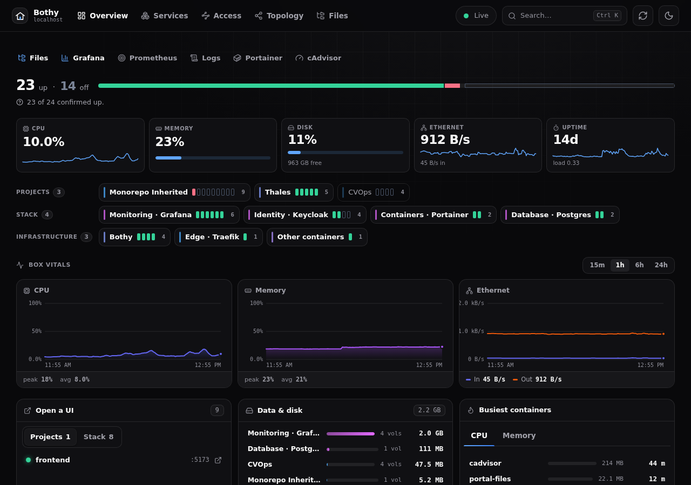

# Architecture

A self-hosted development box: a WSL2 Ubuntu distro that is its own tailnet node,
running ~20 containers, reachable from any device on the tailnet, driven by
`just`.

> **Access model, current as of 2026-08-12: pure IP:port.**
> Every browser-facing service is reached at `http://<node-ip>:<port>`.
> `just urls` prints the table and is the only authority - it reads the address
> from `tailscale` at run time, because this repository is public.
> Start at `http://<node-ip>/`, which is the portal.

**the name layer is retired, not dormant.** It went dormant on
2026-08-08 when the Tailscale split-DNS route was removed, and its configuration
was **deleted on 2026-08-12**. Traefik holds **zero `Host()` rules**. Sections
below that describe names describe history and say so; nothing in this document
is waiting to "light up again". The design argument that produced it is still
worth reading - see [The naming convention](#4-the-naming-convention-retired) -
but it is not how the box works today.

Traefik still owns `:80`, and still matters, but for a smaller job than before:
it serves the portal's catch-all and the portal's read-only `/-/api/*` data
plane, all on host-less exact `Path()` rules. Seven routers exist in total.

**The stack is a helper, not a platform.** It provides what projects *don't*
ship - routing, dashboards, log aggregation. It never provides what projects
*do* ship: a project keeps its own Postgres so it stays self-contained and
portable. If Traefik is down, `tilt up` in a project still works, and so does
every service on its own published port; you lose the portal, not the box.

**The diagrams here are generated, not drawn.** Each one is a mermaid source in
`docs/diagrams/` rendered to an SVG by `just diagrams`; edit the `.mmd`, never
the `.svg`. They used to be fenced mermaid blocks, which GitHub renders and
Bothy's own docs reader cannot - so Bothy showed its own architecture as six code
blocks. `scripts/checks/diagrams.sh` fails if a source and its SVG drift apart.

---

## Contents

1. [The request path](#1-the-request-path)
2. [The two networks](#2-the-two-networks)
3. [The stacks](#3-the-stacks)
4. [The naming convention (retired)](#4-the-naming-convention-retired)
5. [The portal and its discovery join](#5-the-portal-and-its-discovery-join)
6. [Data and backups](#6-data-and-backups)
7. [Adding a service](#7-adding-a-service)
8. [Traps](#8-traps)

---

## 1. The request path

There are two paths now, and which one a request takes depends only on the port.



### Step by step

| Step | What happens | Where it is configured |
|---|---|---|
| A | Most services are reached **directly on a published host port**. No DNS, no proxy, no `Host` header - the browser opens `http://<node-ip>:3000` and hits Grafana's own listener. | each stack's `compose.yml` `ports:`, printed by `just urls` |
| B | Port 80 is Traefik. It matches **path only**, because no router carries a `Host()` rule. Two providers feed it: **docker** (container labels, `exposedbydefault=false`) and **file** (`edge/dynamic/*.yml`, `watch=true`). | `edge/compose.yml` |
| B1 | The portal's `/-/api/*` data-plane routes match at priority 100. Every rule is an exact `Path()` - that is a security boundary, not a style. | `edge/dynamic/portal-api.yml`, `portal-prom.yml` |
| B2 | Everything else falls through to `portal-next-fallback` (`PathPrefix(/)`, priority 1) and gets the portal SPA. **A wrong path returns 200 with the SPA, not a 404** - which is why route tests must assert content type. | `apps/portal-next/compose.yml` |

**No step authenticates.** As of 2026-08-12, no router carries an auth
middleware. See [Identity](#identity-being-rebuilt-not-yet-enforced) below.

### Why plain HTTP is acceptable here

The transport is WireGuard, so traffic is already encrypted, and only tailnet
devices can route to the box at all. TLS would mean a private CA installed on
every device for no gain against that threat model. This is safe *only* while
the tailnet is the outer perimeter.

A device **not** on the tailnet cannot reach the IP at all. That is the first
thing to check when something "stops working" - it is almost always the client,
not the box (see [kb/runbook-cant-reach.md](kb/runbook-cant-reach.md)).

### Identity: being rebuilt, not yet enforced

Recorded 2026-08-12. The previous SSO was oauth2-proxy against GitHub, with the
OAuth callback pinned to `a service hostname`. Deleting the name layer broke the
callback, so it was parked on 2026-08-08 and each dashboard's own login with the
shared `DEV_LOGIN_*` credential became the interim control.

What exists today:

| Piece | State |
|---|---|
| `keycloak` | Running, host port `8090`. Local identity provider, replacing GitHub - so the flow no longer depends on any DNS name. |
| `oauth2-proxy` | Running on `devnet`, no published port. Its callback is an IP:port URL reached through the `oauth2-endpoints` router. |
| `oauth2-endpoints@file` | The only non-portal router: `PathPrefix(/oauth2/)` at priority 100, host-less so the post-login redirect lands wherever the user actually was. |
| `sso@file`, `sso-errors@file` | **Defined and attached to nothing.** Every router on this box is open to the tailnet. |

The separation is deliberate: attaching auth is the step that can lock you out,
and the tools you would use to unlock it (portal, Grafana, Dozzle) are exactly
what you would have just put behind the broken login. Define, verify end to end
against one low-stakes router, then roll outward. The reasoning is written at
length in `edge/dynamic/auth.yml`.

**Until a router carries the pair, treat every service on this box as
unauthenticated to the whole tailnet.** Nothing in this document should be read
as saying auth is enforced.

### Who publishes a host port, and why

The old rule was "nothing browser-facing publishes a port". **That rule is dead
as of 2026-08-12**: with no name layer, a published port is the *only* way a
browser reaches anything but the portal. What exists today:

| Container | Host bind | Status |
|---|---|---|
| `traefik` | `0.0.0.0:80` | **The front door for the portal and its data plane**, and nothing else. |
| `grafana` `prometheus` `dozzle` `kafka-ui` `portainer` `loki` `cadvisor` `node-exporter` `keycloak` | `0.0.0.0:3000` `9090` `8080` `8081` `9000` `3100` `8082` `9100` `8090` | **The access path.** Not a legacy remnant and not a workaround - this is the model. Each is listed in `just urls`. |
| `postgres` `redis` `kafka` | `127.0.0.1:5432` `6379` `9092` | **Loopback only, and non-negotiable.** Dropping the `127.0.0.1:` prefix hands the whole tailnet a database - Redis runs with no `requirepass` at all. Reached over an SSH tunnel, or by name over devnet from another container. |
| `portal-next` `portal-files` `oauth2-proxy` `bothy-socket-proxy` `promtail` and every exporter | none | Nothing needs to reach these except Traefik or Prometheus, over `devnet`. |

The cost of the port model is real and worth stating: ports are a flat global
namespace with no allocator, so every new service is a manual collision check
against `just urls` and against whatever a project under `~/projects` grabs.
That is the problem the name layer existed to solve. It was traded away for
working access, not because the argument was wrong.

Databases are never routed by name:

```sh
ssh -L 5432:localhost:5432 -L 6379:localhost:6379 -L 9092:localhost:9092 <user>@<this-node>
```

### Routing priorities

`edge/dynamic/` is watched live. Malformed YAML is rejected (last-good config is
kept), but *valid* YAML with a wrong priority shadows real routes instantly, with
no restart to catch it.

The whole table, as of 2026-08-12 - seven routers, **zero `Host()` rules**:

| Router | Rule | Priority | Notes |
|---|---|---|---|
| `portal-api-docker@file` | exact `Path(...)` ×2 | 100 | `/-/api/docker/containers/json`, `/system/df`. **The security boundary** - see below |
| `portal-api-loki@file` | exact `Path(...)` ×2 | 100 | `query_range`, `labels` - the portal's log view |
| `portal-api-prom@file` | exact `Path(...)` ×2 | 100 | `query`, `query_range` - from the **gitignored generated** `portal-prom.yml`, which carries a basic-auth header |
| `portal-api-traefik@file` | exact `Path(...)` ×4 | 100 | `http/routers`, `http/services`, `overview`, `version`. The only reachable slice of `api@internal` |
| `oauth2-endpoints@file` | `PathPrefix(/oauth2/)` | 100 | The login flow. Host-less so the post-login redirect lands wherever the user was |
| `portal-next-fallback@docker` | `PathPrefix(/)` | 1 | Catch-all: **every** unmatched path on `:80` gets the portal SPA, 200 `text/html` |
| `prometheus@internal` | `PathPrefix(/metrics)` | max | Traefik's own metrics, on the internal `:8899` entrypoint only |

Two consequences of that table:

- **A "404 test" cannot fail.** The catch-all answers everything, so a blocked
  path returns 200 with the SPA. Assert the **content type**: `text/html` means
  blocked, `application/json` means routed. Verified 2026-08-12.
- **The Traefik dashboard router is gone**, deleted 2026-08-12. It served
  `api@internal` unauthenticated, and `/api/rawdata` rendered the live
  `Authorization: Basic` header that `portal-prom.yml`'s `customRequestHeaders`
  middleware injects - a credential leak through a read-only dashboard.
  `--api.dashboard=true` is now `--api=true`, so `api@internal` still exists as
  a service for the four exact paths above but no router serves the UI.

---

## 2. The two networks



Both networks are **external** - created once by `just network`, then every
compose file joins them with `external: true`. That is what lets separate compose
projects (and separate project repos under `~/projects`) share one edge.

| Network | Members | Purpose |
|---|---|---|
| `devnet` | ~24 containers: the whole stack plus any project container that opts in | The shared bus. Traefik discovers here (`--providers.docker.network=devnet`), Prometheus scrapes here, containers resolve each other by service name here. |
| `socketnet` | **Exactly two**: `traefik` and `bothy-socket-proxy` | Isolation for the Docker socket proxy. |

### Why `socketnet` exists

`docker-socket-proxy` has **no authentication of any kind**, so *network
reachability is authorisation*. On `devnet` it would be one `curl` away from
around two dozen containers, several of them third-party code (kafka-ui,
portainer, project images). Keeping it on a two-member network keeps the blast
radius at two.

Two consequences worth knowing:

- The socket proxy is invisible to Traefik's **docker** provider (that provider is
  pinned to devnet), which is exactly why it is declared in the **file** provider
  instead - `edge/dynamic/portal-api.yml` names it by Docker DNS over socketnet.
- Traefik mounts the socket `:ro`; Dozzle mounts it `:ro`; Portainer mounts it
  **read-write**. Its UI exposes container `Env` and container `exec`, and exec
  is root on this box, so Portainer used to carry the SSO middleware *on top of*
  its own login. Since 2026-08-12 that second layer is gone and its own login on
  port `9000` is the only thing between the tailnet and a root shell. That makes
  Portainer the strongest candidate for the first router to get `sso` back.

### The real security boundary for the portal's Docker API

`CONTAINERS=1` does **not** mean "only `/containers/json`". `docker-socket-proxy`
gates by endpoint *family*, so it also permits `/containers/{id}/json` - whose
body includes `Env`, i.e. every password on the box.

The boundary is therefore the exact `Path()` rules in
`edge/dynamic/portal-api.yml`, and nothing else:

```yaml
rule: >-
  Path(`/-/api/docker/containers/json`)
  || Path(`/-/api/docker/system/df`)
```

Hard rules, in priority order:

1. **Never widen to `PathPrefix`.** That is the credential leak.
2. **`POST: 0` is load-bearing** - without it `CONTAINERS=1` also grants
   `/containers/{id}/kill|stop|restart`.
3. Add a Docker endpoint only as a new exact `Path()`, and only after confirming
   its body carries no `Env`. That check *is* the review.
4. Never `ports:` on the socket proxy. Pin its image; never `:latest`.
5. Never mount the socket into nginx.

**Regression test - assert the content type, not the status.** Rewritten
2026-08-12 after verifying that the old status-code form can no longer fail: the
catch-all router answers every unrouted path with the SPA, so the blocked
endpoint returns **200**, not 404. The status tells you nothing; the body type
tells you everything.

```sh
BOX=127.0.0.1                       # or the tailnet IP - there is no name
CID=$(docker ps -q | head -1)

# BLOCKED - must print text/html (the portal SPA, not a container body)
curl -s -o /dev/null -w '%{content_type}\n' \
  http://$BOX/-/api/docker/containers/$CID/json

# ALLOWED - must print application/json
curl -s -o /dev/null -w '%{content_type}\n' \
  http://$BOX/-/api/docker/containers/json
```

If the blocked line ever prints `application/json`, a rule has been widened and
every container's `Env` is on the tailnet.

**Nothing else guards this.** The old note here said the `sso` middleware also
closed a DNS-rebinding hole, because a rebound request carries the attacker's
`Host` and so never receives the `.the name layer`-scoped session cookie. That
reasoning died with the name layer on 2026-08-12: there is no name and no
name-scoped cookie. DNS rebinding is also no longer the relevant attack - there is
no name to rebind, only an IP. This data plane is not role-gated the way the
editor tier is, so the exact `Path()` rules are its entire control, alone.

**What this deliberately exposes to the tailnet, unauthenticated:** container
names, images, ports, health, labels, mounts and per-volume disk sizes, plus
every Prometheus metric and label value. **Not `Env`, and not the metrics
credential** - that header is injected at the edge and never reaches the
browser. This is home-directory-layout disclosure, judged acceptable on a
personal tailnet and on nothing wider.

---

## 3. The stacks



### What is in each stack

Access is a port, not a hostname. The authoritative list is `just urls`; the
numbers below are repeated here only so this table is readable on its own.

| Directory | Compose project | Containers | Access | Login |
|---|---|---|---|---|
| `edge/` | `edge` | `traefik` | `:80` - portal + `/-/api/*` only | none, and none needed: no dashboard router exists any more |
| `auth/` | `auth` | `keycloak` `oauth2-proxy` | Keycloak `:8090`; oauth2-proxy only via `/oauth2/` on `:80` | n/a - it *is* the identity layer, and it guards nothing yet |
| `monitoring/` | `monitoring` | `prometheus` `grafana` `loki` `promtail` `cadvisor` `node-exporter` | `:9090` `:3000` `:3100` - `:8082` `:9100` for the exporters | Grafana and Prometheus use the shared `DEV_LOGIN_*` credential. Prometheus runs `--web.enable-lifecycle`, so an unauthenticated `POST /-/quit` would stop it - its login is the only thing preventing that |
| `data/postgres` | `postgres` | `postgres` `postgres-exporter` | `127.0.0.1:5432` | Postgres' own |
| `apps/bothy` | `bothy` | `bothy-socket-proxy` (the read-only Docker socket the portal's data plane goes through) | none - socketnet only | n/a |
| `apps/portal-next` | `portal-next` | `portal-next` | the `:80` catch-all | **none** |
| `apps/portal-files` | `bothy` | `portal-files` | none - filesnet only | `viewer` to read, `editor` to write, enforced at the edge |
| `host/` | - | none | - | - |

Every "none" in that last column is reachable by anything on the tailnet without
authenticating. That is the current, accepted state, not an oversight - see
[Identity](#identity-being-rebuilt-not-yet-enforced).

Notes on `apps/`:

- **`portal-next` is the portal, and the only one.** The original pure-HTML
  `apps/portal` nginx was retired behind `traefik.enable=false` and kept as a
  one-line rollback until 2026-08-17, when it was deleted - the rollback was a
  fiction, because the HTML it served linked to hostnames that stopped resolving
  when the name layer was retired on 2026-08-12. `apps/portal/` itself went on
  2026-08-18; the socket-proxy fragment that was its only remaining reason to
  exist moved to `apps/bothy/socket-proxy.yml`.
  **Do not `docker compose down` the `bothy` project to restart the portal** -
  that project also owns `bothy-socket-proxy`, which the live portal depends on
  for `/-/api/docker`. Act on the one service.
- **Bothy Files replaced every markdown viewer this box has had.** It is a route
  in the portal (`/#/files`) backed by `apps/portal-files`, and it reads the real
  file from a bind mount rather than a mirror of it - so there is no sync lag, no
  second copy to keep out of git, and the same surface can search, render and
  edit. Wiki.js was retired, and on 2026-08-18 `apps/wiki/` and its `wiki`
  database were deleted outright - the content it held was the last argument for
  keeping either, and it had already been superseded by the files themselves.

### Observability, and why it covers everything for free

Two of the three collectors discover through the Docker socket instead of a
hand-kept target list, so *every* container is covered with no per-service setup:

| Signal | Collector | Coverage |
|---|---|---|
| Logs | `promtail` via `docker_sd_configs` → Loki | Every running container, any stack or project. Labels: `container`, `stack` (compose project), `stream`. |
| Container metrics | `cadvisor` → Prometheus | CPU / memory / network / filesystem, every container. |
| Host metrics | `node-exporter` | |
| Docker daemon | `metrics-addr` on `:9323` (optional, in `host/docker/daemon.json`) | **Not scraped.** The `docker-daemon` job was removed on 2026-08-19: nothing in the repo read an `engine_daemon_*` series, and because the setting is opt-in the target sat permanently down on any box that had not been hand-edited. The setting is harmless to keep; `monitoring/prometheus.yml` carries the restore recipe. |
| App metrics | `postgres-exporter`, `redis-exporter`, `kafka-exporter` | Down while those stacks are down - expected. |
| The edge | `traefik` Prometheus metrics on an **internal** entrypoint `:8899` | Request rate, latency and error rate per router / service / entrypoint. No host port - Prometheus reaches it by name over devnet. |

Grafana auto-provisions the Prometheus and Loki datasources, five dashboards, and
alerting (instance down, host memory > 90%, disk > 85%).

### Lifecycle

Everything runs through `just`, which loads the root `.env` via
`set dotenv-load`. A bare `docker compose -f …` looks for a `.env` beside the
compose file it was handed, finds none, and either falls back to insecure
defaults or aborts on a required variable - so **always use `just`**.

| Recipe | Effect |
|---|---|
| `just network` | Create `devnet` and `socketnet` (idempotent) |
| `just up` | `network` → `up-edge` → `up-auth` → `up-monitoring` → `up-data` → `up-mgmt` → `up-apps`, in that order |
| `just up-edge` / `up-auth` / `up-monitoring` / `up-data` / `up-mgmt` / `up-apps` | One group |
| `just doctor` | Containers, Prometheus targets, k8s node, disk/memory, backup **age and size** |
| `just backup` | The same script the 03:00 timer runs |
| `just urls` | Every address, read from `tailscale` at run time |
| `just down` | Stop everything, keep volumes |
| `just nuke` | Stop everything **and delete every volume** - destructive, sits one keystroke from `down` in the recipe list |

Ordering is not cosmetic: the edge must exist before anything expects to be
routed, and `auth` must exist before the routers that reference its middleware.

---

## 4. The naming convention (retired)

**Retired 2026-08-12.** The the name layer no longer exists: the
Tailscale split-DNS route was removed on 2026-08-08, dnsmasq answers nothing for
the box any more, every `Host()` router rule was deleted, and access is
`http://<node-ip>:<port>`. This section is kept because the argument that
produced it is still the best statement of what a port model costs - and because
the rules below are what any replacement would have to re-derive.

Nothing here is a live instruction. Do not write a `Host()` rule.

### What it was



| Shape | Meant |
|---|---|
| the name layer | The portal. The base of the namespace. |
| `<service>.the name layer` | A shared stack service. |
| `<project>.the name layer` | One branch per project. |
| `<sub>.<project>.the name layer` | A piece belonging to that project. |

A project's own pieces nested under the **project**, not at the top level:
`a nested hostname`, never `s3.the name layer`. A flat name could only ever mean one
project's piece, which re-creates the port-collision problem one layer up.

Adding a service was two Traefik labels and a hostname - no DNS entry, no port
allocation, nothing restarted. That is the property the current model lost.

### What survived the retirement

- **`.test`, never `.dev`.** `.dev` is a real Google gTLD and is HSTS-preloaded,
  so browsers force `https://` on it unconditionally and a plain-HTTP page never
  loads; there is no opt-out. `.test` is reserved by RFC 6761 and nothing
  preloads it. If a name layer is ever rebuilt here, this constraint is
  unchanged.
- **Hostname nesting is still load-bearing *in the portal*.** `discover.ts`
  groups by hostname depth before it looks at compose labels. With no `Host()`
  rules, `extractHost()` returns `null` for every router today and that grouping
  path is simply inert - it is not deleted, and it is what would light up first
  if names returned.

### What did not survive, and why the reasons are now dead

| Old rule | Why it no longer applies |
|---|---|
| Everything must stay under `.the name layer`, never a sibling like `tilt.test`, because the oauth2-proxy cookie was scoped to `.the name layer` | There is no name-scoped cookie. Identity is being rebuilt on Keycloak with an IP:port callback precisely so it depends on no DNS name |
| `a service hostname` is deliberately flat, with `a nested host process` as an alias | Tilt is reached at `<node-ip>:10350`. The name never distinguished projects anyway - Tilt binds one fixed port and only one project can hold it, so it always meant "whoever last ran `tilt up`". `edge/dynamic/host-services.yml` is now a comments-only stub recording this |
| A device not on the tailnet gets `NXDOMAIN` | It gets no route to the IP at all. Same outcome, different layer |

### The dead end worth recording

The name layer was not abandoned because it was a bad design. It was abandoned
because it had **one** dependency that could fail totally - the Tailscale
split-DNS route - and when that went, every address on the box died at once
while every container stayed perfectly healthy. A model where the failure of one
DNS setting takes out all access has a resilience problem the elegance does not
pay for. Ports are ugly and they always work.


## 5. The portal and its discovery join

The portal - **Bothy**, at `http://<node-ip>/` - **discovers what is running**.
It is not a hand-written list and must never become one again.

Note what the retirement did to that claim, recorded 2026-08-12: the discovery
mechanism is unchanged and still correct, but its *input* shrank. Traefik now
reports seven routers instead of twenty-two, so the Docker half of the join
(containers, ports, health, images, disk) carries nearly all the weight, and a
service that publishes a port but has no router still appears - it is discovered
from `/containers/json`, not from a route. The route table is no longer the
skeleton it was; it is closer to a rib.



It is a Vite + React app built to static files by a multi-stage image (node
builds, nginx serves `dist/`), routed by the catch-all `PathPrefix(/)` at
priority 1 and nothing else - the `Host(the name layer)` router it also carried was
deleted on 2026-08-12. Like everything else on the box today it sits behind no
authentication. Deep links use `HashRouter` so static nginx needs no rewrite
rules.

### The data plane

Two read-only APIs, both proxied under the portal's **own origin** at `/-/api/*`,
which means zero CORS, no preflight and no headers to tune. `/-/` is a reserved
prefix on every vhost on this box.

| Path | Backend | Gives |
|---|---|---|
| `/-/api/traefik/http/routers` | `api@internal` | Every route, including host processes (`@file`) - **the skeleton** |
| `/-/api/traefik/http/services` | `api@internal` | Server targets, for the join |
| `/-/api/docker/containers/json` | `bothy-socket-proxy` | Ports, health, images, compose labels, `Mounts` - **the enrichment** |
| `/-/api/docker/system/df` | `bothy-socket-proxy` | Per-volume / image / container disk sizes |

**Traefik is the skeleton; Docker is enrichment. Either can die and the page still
renders** - the loader uses `Promise.allSettled`, never `all`, and partial results
are first class. Polling is 10 s, pauses on `document.hidden`, refreshes on focus,
and backs off to 60 s after three failures. It **never clears on failure**: a stale
page with working links beats a blank one. If both APIs die, a static
`KNOWN_HOSTS` floor renders. This is the page you open when things are broken, so
it must never be blank.

### The join



The chain in one line: **router → service → server URL → devnet IP → container**.
The implementation is `apps/portal-next/web/src/lib/discover.ts`, deliberately
pure (no DOM, no fetch, no globals) because the join is the part with real bugs
in it.

### The three traps

All three are real on this box, and all three were paid for:

1. **`router.service` has no `@provider` suffix; `service.name` does.**
   A router reports `service: "cvops-s3"` while the service reports
   `name: "cvops-s3@docker"`, so a naive lookup misses every time. The key is
   built as `r.service.includes('@') ? r.service : r.service + '@' + r.provider`.
   The exception is `dashboard@docker`, whose service is already `api@internal`
   and must not be suffixed again.

2. **Index `devnet` IPs only.** Traefik runs with
   `--providers.docker.network=devnet`, so every docker-provider server URL is a
   devnet IP. Indexing all of a container's networks collides - `172.18.0.4` and
   `172.19.0.4` both exist here, and the join would attach the wrong container.
   The portal reads `NetworkSettings.Networks.devnet.IPAddress` and nothing else.

3. **`extractHost()` returns `null` rather than guess.** It returns null for
   `PathPrefix(/)` (the fallback router has no host at all), for `HostRegexp`, and
   for multi-host `Host(a, b)`. A wrong guess files a card under the wrong project
   *silently*; a null falls through to the Routes tab, *visibly*. Never make it
   guess.

Two more behaviours worth knowing:

- **Fallback join.** Containers carry their own `traefik.http.routers.<name>.*`
  labels, so router → container survives a stale Traefik server IP even when the
  IP index misses.
- **Two routers can name the same backend.** `merge()` collapses routes by
  resolved service key, keeps the **shallowest** hostname as canonical and the
  rest as `node.aliases`. Emitting both would double-count one process in every
  total and force a guess about which project owns it. The case that paid for
  this was `a service hostname` and `a nested host process`, two routers on one
  `tilt@file` → `host.docker.internal:10350`. **Dormant since 2026-08-12** -
  with no `Host()` rules there are no aliases to collapse, and the code is kept
  because the situation recurs the moment two routes ever share a service again.

### Classification, with no hand-maintained list

A container's `com.docker.compose.project.config_files` label says where its
compose file lives:

| Config path | Classified as |
|---|---|
| Under `<stacks root>/apps/` — Bothy's own tiers | **infra** |
| Elsewhere under the stacks root | **stack** (`edge` → **infra**, by name: it is not under `apps/`) |
| Anywhere else | **project** |
| Missing entirely (e.g. minikube) | **unmanaged / infra** |

Hostname nesting then **beats** that classification, which is what puts a
container-less `@file` host process into the right project panel.

A route with no container is rendered loudly (rose dot, "no container" badge) -
a dangling route is exactly what the portal should shout about.

**Infra is a place on disk, not a list of names.** It was a set of five project
names in `discover.ts` and the set had already gone stale — `bothy-control` and
`bothy-config` were split out of the `bothy` project after it was written and
rendered as two more "Stack" systems. A name test is also unsafe: compose project
names are global to the docker daemon and belong to whoever claimed them first,
so a checkout at `~/projects/portal` was being declared part of Bothy. The names
survive only for the case the path test cannot answer — **no stack root known**,
before the first `just up` or with the file tier down — where the portal must
still avoid misfiling itself.

### Identity vs display grouping

Every node carries **two** group fields, and the difference is load-bearing:

| Field | Means | Set by |
|---|---|---|
| `system` | what this service **is** | derived: hostname nesting → compose project → `unmanaged`/`host`. No label can move it |
| `group` | where it is **shown** | `dev.portal.group`, falling back to `system` |

They are the same string on a box with no `dev.portal.group` labels, which is why
regrouping changes nothing until somebody asks for it. `group` used to be one
field doing three jobs — the panel, the `/control/systems/:name` URL people
bookmark, and the seed the accent colour is hashed from — so any user-facing
regroup would have 404'd bookmarks and reshuffled colours. Now:

- `System.identities` lists the `system` values folded into a display group;
- the accent is hashed from `primaryIdentity()`, so a merged card keeps a
  member's colour rather than inventing one;
- `findSystem()` resolves a URL by display key **then** by identity, so a
  bookmark taken before a regroup still opens.

Truth table: `apps/portal-next/checks/grouping.mjs`.

### Optional polish labels

Everything above works with **zero labels**. If the page ever *needs* a label to
be correct, the defaults are wrong.

| Label | Effect |
|---|---|
| `dev.portal.project` | Display name for the whole compose project - one label fixes every breadcrumb, panel title and unrouted card |
| `dev.portal.name` | This service's display name |
| `dev.portal.icon` | Emoji |
| `dev.portal.desc` | Card body text |
| `dev.portal.group` / `.groupKind` | Force which panel it lands in. Display only — the node's `system` identity, its accent and its old URL are unaffected. Honoured by the Overview, Services **and** the Ports table (until 2026-08-19 the last one ignored it) |
| `dev.portal.hidden=true` | Drop from Services (still listed in Ports and Routes) |
| `dev.portal.path` | Deep link, e.g. `/targets` |
| `dev.portal.order` | Sort order within a panel |

Host processes have no container to label, so their overrides live in a small
`HOST_OVERRIDES` const in `discover.ts`. Two entries is not a config system; at
around eight, promote it to a fetched `portal.json`.

### One thing not to reintroduce

**Do not add a browser-side reachability probe.** A cross-origin `fetch` returns
an opaque response that resolves for *any* HTTP status, so it reported 502 and 401
as "up" - dead services rendered a green chip. Traefik's `serverStatus` is no
better: it reports every server `UP` when no health check is configured, which is
the case for all of these. An `@file` route with no container is honestly
`unknown`, with the reason shown in the UI.

---

## 6. Data and backups



### The volumes

| Volume | Owner | Holds | In the backup |
|---|---|---|---|
| `postgres_postgres_data` | `data/postgres` | The shared dev database | yes - logical dump |
| `monitoring_prometheus_data` | `monitoring` | TSDB, 15-day retention | no |
| `monitoring_grafana_data` | `monitoring` | `grafana.db` - users, dashboards, alert state | yes |
| `monitoring_loki_data` | `monitoring` | Log chunks and index | no |
| `monitoring_promtail_positions` | `monitoring` | Read offsets. **Not data, but load-bearing:** positions default to `/tmp`, which is empty again after every restart, so promtail re-read every container log from the start and duplicated the whole history into Loki each time it came back. | no |
| `mgmt_portainer_data` | `mgmt` | `portainer.db` | yes |

`KAFKA_LOG_DIRS` is set explicitly for the same class of reason: without it the
broker writes to its built-in default, the mounted volume stays empty, and every
topic dies with the container.

### What the nightly backup covers

`stacks-backup.timer` fires `scripts/backup.sh` at 03:00 daily and keeps the
newest **14** of each: the Postgres dump, the Redis snapshot, `grafana.db`,
`portainer.db`, and `.env`.

`.env` is in there because it is gitignored and exists in exactly one place on
earth. Losing it loses every credential on the box.

Three deliberate design points, each of which is a bug that already happened:

- **It waits for Postgres to accept connections before dumping.** The timer is
  `Persistent=true`, so a schedule missed while the box was off fires at the next
  boot - exactly when Postgres is still initialising. Without the wait the dump
  comes back empty and the run reports success.
- **It verifies every artifact is non-empty before keeping it.** An empty artifact
  is worse than none: rotation counts it and would eventually evict a good backup
  with a worthless one. A failed `pg_dumpall` still leaves behind a perfectly
  valid gzip of nothing.
- **It is deliberately not `set -e`, but it exits non-zero if anything failed.**
  The old script aborted on the first failure, which is how one bad Postgres dump
  left Redis, Grafana and Portainer un-backed-up for six days with nothing looking
  wrong.

`just doctor` checks backup **age and size**, not mere existence, for the same
reason.

**Known gap:** backups sit on the same disk they protect. Copying them off the box
is not solved.

---

## 7. Adding a service

Rewritten 2026-08-12 for the pure-IP model. The two-label recipe that used to
live here produced a `Host()` rule and is no longer valid - Traefik has no name
to match on, so those labels register a router that can never fire.

### A container a browser reaches

Pick a free port, publish it, join `devnet` so Prometheus and the portal can see
it, and add it to `just urls`:

```yaml
services:
  myapp:
    image: myorg/myapp
    networks: [default, devnet]      # BOTH - see the warning below
    ports:
      - "8099:8080"                  # HOST:CONTAINER. Check the port is free first.
    labels:
      # Optional polish for the portal. Discovery works with zero labels.
      - dev.portal.name=My App
      - dev.portal.desc=What it does.

networks:
  devnet:
    external: true
```

Then, in order:

| Step | Why |
|---|---|
| `just urls` and `docker ps --format '{{.Ports}}'` **before** choosing the number | Ports are a flat namespace with no allocator. This check is the cost of the model; there is no way around it |
| Add the port to the `urls` recipe in the `justfile` | `just urls` is the only inventory. A service missing from it is a service nobody finds |
| Give it a login | It is on the tailnet with no auth in front of it. Use the shared `DEV_LOGIN_*` credential from `.env`, the way Grafana, Portainer, Dozzle, Kafka-UI and Prometheus do |
| **Do not** add `traefik.http.routers.*.rule=Host(...)` | There is no name layer. The router would register and never match |
| **Do not** attach `sso-errors@file,sso@file` yet | They are defined but attached to nothing on purpose. Attaching one router at a time is the rollout plan, not a per-service decision |

> **Listing `networks:` on a service silently drops it off the compose default
> network.** Always write `[default, devnet]`, or the service loses its own
> database.

### A container nothing browses

Publish nothing. Join `devnet` and let other containers reach it by service
name. This is still the correct default for exporters, sidecars and proxies -
`bothy-socket-proxy`, `oauth2-proxy`, `portal-files` and every `*-exporter` do it.

### A host process

`edge/dynamic/host-services.yml` used to route these by name. It is now a
comments-only stub: **reach a host process on its own port**, e.g. Tilt at
`<node-ip>:10350`.

> **The process must bind `0.0.0.0`.** `127.0.0.1` is reachable only from this
> box - not from a container, and not from any other tailnet device. For Tilt
> that means `tilt up --host=0.0.0.0 --port=10350`. This was already the usual
> cause of a 502 through Traefik; under the port model it is the usual cause of
> a connection refused.

If a host process ever genuinely needs a Traefik route again, it cannot be a
`Host()` rule. It would have to be a host-less exact `Path()` - the shape the
data plane uses - and it would answer on every address at once. Consider
whether a published port is not simply the better answer.

### A database

Bind `127.0.0.1` explicitly and route nothing:

```yaml
ports:
  - "127.0.0.1:5432:5432"
```

Containers reach it by name over `devnet`; humans reach it over an SSH tunnel.

### Checklist

| | |
|---|---|
| A free port | Checked against `just urls` and `docker ps` first |
| Listed in `just urls` | Otherwise it is invisible |
| On `devnet` | with `[default, devnet]`, so Prometheus and the portal see it |
| A login | The shared `DEV_LOGIN_*` credential. Nothing else is guarding it |
| Loopback if it is a database | `127.0.0.1:PORT:PORT`, never a bare `PORT:PORT` |
| No `Host()` rule | There is no name layer to match |
| No SSO middleware | Defined, deliberately unattached - do not be the first to attach one by accident |
| Verify | `curl -s http://127.0.0.1/-/api/traefik/http/routers` for routes; the portal for everything else |

---

## 8. Traps

The ones that fail *silently*. Each has cost real debugging time here.

| Trap | Symptom | Fix |
|---|---|---|
| **Traefik's `edge/dynamic` bind mount goes stale after `git checkout`** | Every edit to `edge/dynamic/` has no effect; `--providers.file.watch=true` stops meaning anything. A bind mount pins the host inode at container-creation time, and checkout deletes and recreates directories. Ran that way for five days once. | `docker compose -f edge/compose.yml up -d --force-recreate` after any branch switch |
| **Editing a bind-mounted config *file* replaces its inode** | `prometheus.yml`, `promtail.yml`, `loki-config.yml` keep serving the old content. A plain `restart` reads the stale inode. | `docker compose -f monitoring/compose.yml up -d --force-recreate <svc>` |
| **Traefik below v3.6 on Docker 29** | *Every* request 404s while Traefik looks perfectly healthy - older builds hardcode Docker API v1.24, ignore `DOCKER_API_VERSION`, and the provider loads zero routes | Keep Traefik ≥ v3.6 and `DOCKER_API_VERSION: "1.44"` |
| **Listing `networks:` drops the compose default network** | A service mysteriously cannot reach its own database | Always `[default, devnet]` |
| **A dotless hostname in a *host* process** | Looked like a database fault: `getaddrinfo` hung 40 s per lookup, starving libuv's four-thread pool, so unrelated DB connections timed out with no TCP socket ever opened. Bare compose names (`tempo`, `redis`) only resolve inside Docker. | dnsmasq now runs `domain-needed`, so dotless names `NXDOMAIN` in ~0 ms. If you genuinely need one, add an explicit `address=/name/<ip>` rather than removing the flag. |
| **`systemctl reload dnsmasq` does not re-read the config** | A config edit appears to do nothing. SIGHUP only re-reads `/etc/hosts` and clears the cache. | `sudo dnsmasq --test` then `sudo systemctl restart dnsmasq` |
| **`/etc/resolv.conf` is immutable on purpose** | WSL rewrites it whenever Windows' DNS configuration changes | `sudo chattr -i` to edit, `+i` when done |
| **The box must stay awake** | WSL2 destroys the VM 60 s after the last Windows-side client disconnects, taking docker, every container and the tailnet node with it. The box appeared to work only while somebody was connected over SSH. | A Windows scheduled task holds `wsl -e sleep infinity` open - `host/windows/`. `restart: unless-stopped` is inert if the daemon never starts. |
| **A wrong `priority` in `edge/dynamic/` shadows real routes instantly** | Malformed YAML is safely rejected (last-good kept) - but *valid* YAML with a bad priority applies live, with no restart to catch it | Only two priorities exist now: catch-all = 1, everything else = 100. Anything at 1 that is not the portal fallback is a bug |
| **A doubled brace anywhere in `edge/dynamic/`, even in a comment** | The WHOLE file silently loads nothing - no routers, no middlewares - while the file on disk looks perfect. Traefik renders every file in that directory as a Go template before parsing the YAML, and does not skip comments. Cost a debugging session on 2026-08-12. | Never write a `docker inspect -f` format string in those comments. Use the `jq` form. Single braces (Traefik's own `{url}`) are fine |
| **A route test that asserts a status code** | It can never fail. The catch-all answers every unrouted path with the portal SPA at **200**, so a leak and a block look identical by status | Assert `%{content_type}`: `text/html` is blocked, `application/json` is routed. Verified 2026-08-12 |
| **A `Host()` rule written from an old doc or an old skill** | The router registers, reports `enabled`, and matches nothing ever. There is no name layer and no client resolves `.test` | Publish a port. If you truly need a Traefik route, it must be a host-less exact `Path()` |
| **`docker compose` without `just`** | Falls back to insecure defaults or aborts on a required variable, because it looks for `.env` beside the compose file | Always `just` |

---

## Rebuilding this box

`host/` holds copies - not live files - of everything that is not in a container
and that git would otherwise never see:

| Copy | Real location | Why it matters |
|---|---|---|
| `dnsmasq/dev.conf` | `/etc/dnsmasq.d/dev.conf` | Historical: it held the wildcard the name layer record. **Nothing depends on it as of 2026-08-12** - the name layer is retired. Still worth keeping for `domain-needed`, which makes a dotless lookup `NXDOMAIN` in ~0 ms instead of hanging 40 s (see the traps table). |
| `docker/daemon.json` | `/etc/docker/daemon.json` | Log rotation (10 MB × 3) - that is what this file is for. Also `metrics-addr` on `:9323`, optional since the `docker-daemon` scrape job was removed on 2026-08-19; nothing reads it now. |
| `wsl/wsl.conf` | `/etc/wsl.conf` | `systemd=true` - the reason `docker.service` can be enabled and every stack comes back with the distro. Also `generateResolvConf=false`. |
| `wsl/wslconfig` | the Windows user profile | Memory, CPU and nested virtualisation for the VM |
| `wsl/resolv.conf` | `/etc/resolv.conf` | Points the box at its own dnsmasq; held with `chattr +i` |
| `systemd/stacks-backup.*` | `/etc/systemd/system/` | The 03:00 backup timer |
| `systemd/minikube.service` | `/etc/systemd/system/` | Starts minikube with the distro |
| `windows/DevBox-WSL-Keepalive.xml` | Windows Task Scheduler | The keepalive. Nothing in this repository can substitute for it. |

After editing a real file, copy it back here - so a change to host state leaves a
diff behind instead of vanishing.
