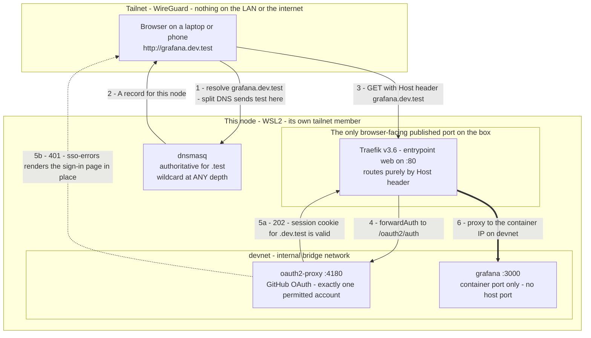
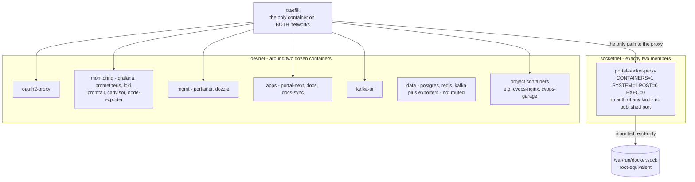
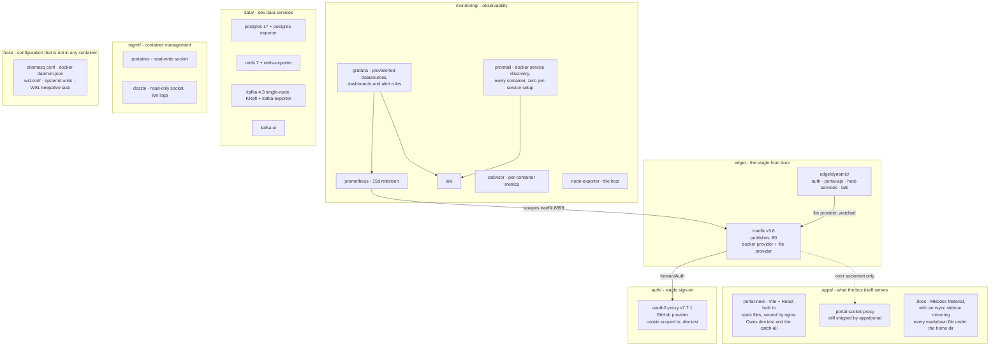
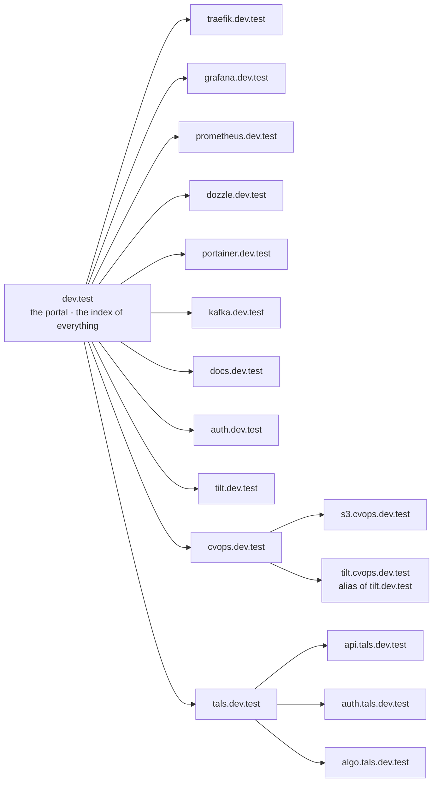
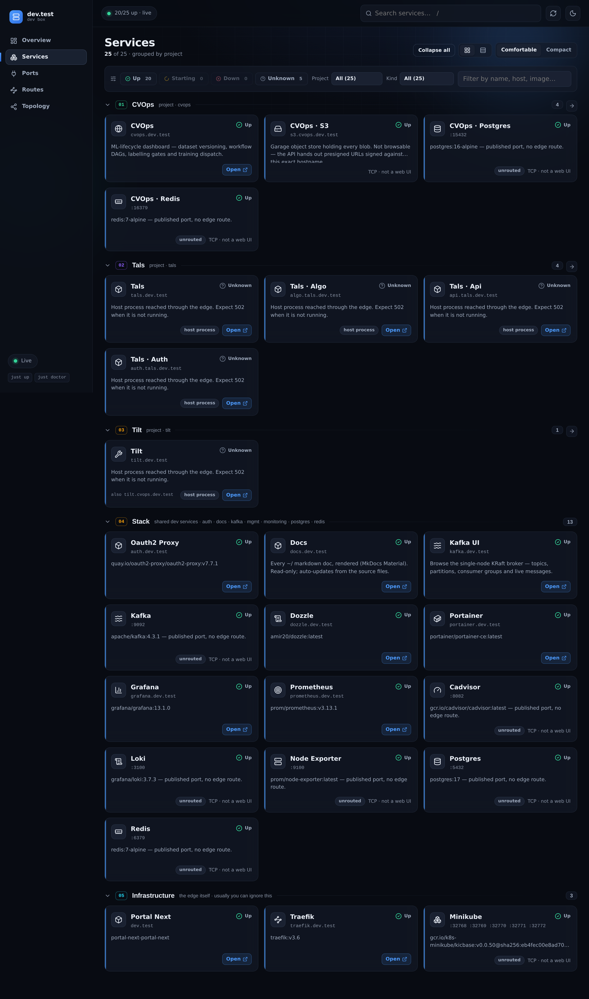
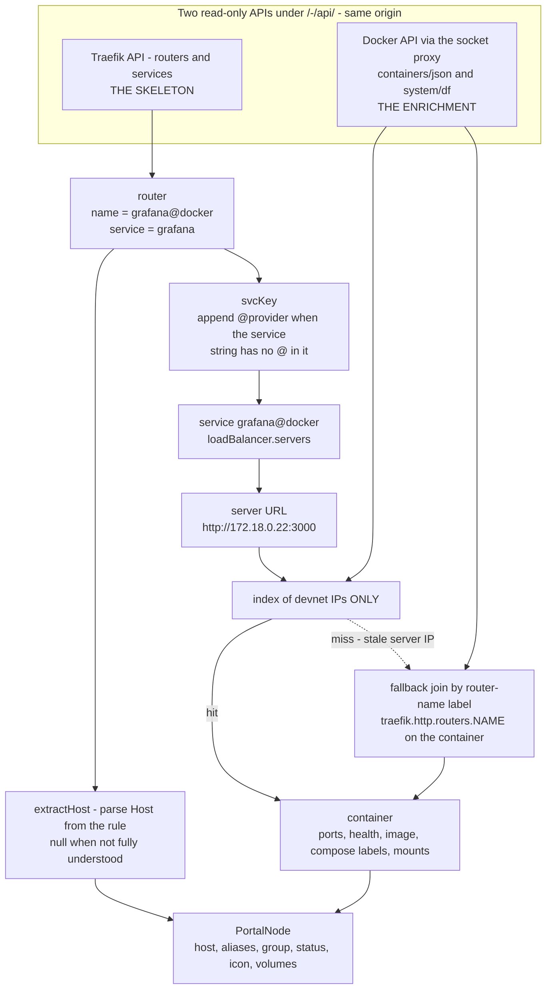
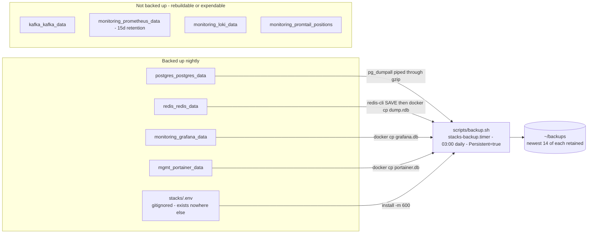

# Architecture

A self-hosted development box: a WSL2 Ubuntu distro that is its own tailnet node,
running ~20 containers behind one reverse proxy, reachable by name from any
device on the tailnet, driven by `just`.

The whole design follows from one decision:

> **Host ports are a flat global namespace with no allocator. Names are
> unlimited. So nothing here gets a port — it gets a name.**

Every service is reached at `<something>.dev.test`. Traefik owns `:80` and routes
by `Host` header; a local dnsmasq answers `*.test` at any depth; Tailscale split
DNS points `test` queries at this node. Adding a service is two Traefik labels
and a hostname — no DNS entry, no port allocation, no restart of anything else.

**The stack is a helper, not a platform.** It provides what projects *don't*
ship — routing, DNS, dashboards, log aggregation. It never provides what projects
*do* ship: a project keeps its own Postgres so it stays self-contained and
portable. If Traefik is down, `tilt up` in a project still works; you just lose
the pretty hostname.

---

## Contents

1. [The request path](#1-the-request-path)
2. [The two networks](#2-the-two-networks)
3. [The stacks](#3-the-stacks)
4. [The naming convention](#4-the-naming-convention)
5. [The portal and its discovery join](#5-the-portal-and-its-discovery-join)
6. [Data and backups](#6-data-and-backups)
7. [Adding a service](#7-adding-a-service)
8. [Traps](#8-traps)

---

## 1. The request path



### Step by step

| Step | What happens | Where it is configured |
|---|---|---|
| 1–2 | Tailscale split DNS routes every `test` query to this node. dnsmasq is authoritative for `.test` and answers with this node's tailnet IP. `address=/test/` is a wildcard at any depth, so `a.b.c.test` needs no DNS work. | `host/dnsmasq/dev.conf` (a copy of `/etc/dnsmasq.d/dev.conf`) |
| 3 | Traefik is the only container publishing `:80`. It matches the `Host` header against its routers. Two providers feed it: **docker** (container labels, `exposedbydefault=false`) and **file** (`edge/dynamic/*.yml`, `watch=true`). | `edge/compose.yml` |
| 4–5 | Routers that need a login carry `middlewares=sso-errors@file,sso@file`. `sso` is a `forwardAuth` to oauth2-proxy: 202 passes, 401 blocks. `sso-errors` catches that 401 on the way out and serves the real sign-in page at the URL actually requested — without it a signed-out user gets a blank 401 with no way forward. **Order matters.** | `edge/dynamic/auth.yml`, `auth/compose.yml` |
| 6 | Traefik proxies to the container's **devnet** IP and its **container** port. The service publishes nothing. | the service's own compose labels |

### Why plain HTTP is acceptable here

The transport is WireGuard, so traffic is already encrypted. TLS on `*.dev.test`
would mean a private CA installed on every device. This is also why the provider
is GitHub rather than Google: Google rejects `http://` redirect URIs, which would
force TLS. `--cookie-secure=false` follows from the same choice, and is safe only
while the tailnet is the transport.

A device **not** on the tailnet gets `NXDOMAIN`. That is the first thing to check
when a name "stops working".

### Who publishes a host port, and why

The rule is that nothing browser-facing publishes a port. What exists today:

| Container | Host bind | Status |
|---|---|---|
| `traefik` | `0.0.0.0:80` | **The front door.** The one intentional publish. |
| `grafana` `prometheus` `dozzle` `kafka-ui` `portainer` `loki` `cadvisor` `node-exporter` | `0.0.0.0:3000` `9090` `8080` `8081` `9000` `3100` `8082` `9100` | Legacy — these predate the edge and kept their old ports. Fully redundant with their `.dev.test` names; removing them is a safe incremental cleanup. |
| `postgres` `redis` `kafka` | `127.0.0.1:5432` `6379` `9092` | **Loopback only, and legitimate.** These speak no `Host` header, so they cannot be routed. Reached over an SSH tunnel, or by name over devnet from another container. |
| `portal-next` `docs` `docs-sync` `oauth2-proxy` `portal-socket-proxy` `promtail` and every exporter | none | The correct pattern. |

Databases are never routed by name:

```sh
ssh -L 5432:localhost:5432 -L 6379:localhost:6379 -L 9092:localhost:9092 <user>@<this-node>
```

### Routing priorities

`edge/dynamic/` is watched live. Malformed YAML is rejected (last-good config is
kept), but *valid* YAML with a wrong priority shadows real routes instantly, with
no restart to catch it.

| Router | Rule | Priority | Notes |
|---|---|---|---|
| `portal-api-docker`, `portal-api-traefik` | exact `Path(...)` | 100 | **No `Host()` rule** — must work from every vhost and from the bare IP |
| `oauth2-endpoints` | `PathPrefix(/oauth2/)` | 100 | Host-less for the same reason: the post-login redirect can land on any host |
| every `<name>.dev.test` | `Host(...)` | Traefik's default, derived from rule length (~16–27) | |
| `portal-next-fallback` | `PathPrefix(/)` | 1 | Catch-all: the bare IP and any typo'd `.test` name land on the portal instead of a bare 404 |

---

## 2. The two networks



Both networks are **external** — created once by `just network`, then every
compose file joins them with `external: true`. That is what lets separate compose
projects (and separate project repos under `~/projects`) share one edge.

| Network | Members | Purpose |
|---|---|---|
| `devnet` | ~24 containers: the whole stack plus any project container that opts in | The shared bus. Traefik discovers here (`--providers.docker.network=devnet`), Prometheus scrapes here, containers resolve each other by service name here. |
| `socketnet` | **Exactly two**: `traefik` and `portal-socket-proxy` | Isolation for the Docker socket proxy. |

### Why `socketnet` exists

`docker-socket-proxy` has **no authentication of any kind**, so *network
reachability is authorisation*. On `devnet` it would be one `curl` away from
around two dozen containers, several of them third-party code (kafka-ui,
portainer, project images). Keeping it on a two-member network keeps the blast
radius at two.

Two consequences worth knowing:

- The socket proxy is invisible to Traefik's **docker** provider (that provider is
  pinned to devnet), which is exactly why it is declared in the **file** provider
  instead — `edge/dynamic/portal-api.yml` names it by Docker DNS over socketnet.
- Traefik mounts the socket `:ro`; Dozzle mounts it `:ro`; Portainer mounts it
  **read-write**, which is why Portainer sits behind SSO even though it has a
  login of its own. Its UI exposes container `Env` and container exec, and exec is
  root on this box.

### The real security boundary for the portal's Docker API

`CONTAINERS=1` does **not** mean "only `/containers/json`". `docker-socket-proxy`
gates by endpoint *family*, so it also permits `/containers/{id}/json` — whose
body includes `Env`, i.e. every password on the box.

The boundary is therefore the exact `Path()` rules in
`edge/dynamic/portal-api.yml`, and nothing else:

```yaml
rule: >-
  Path(`/-/api/docker/containers/json`)
  || Path(`/-/api/docker/system/df`)
```

Hard rules, in priority order:

1. **Never widen to `PathPrefix`.** That is the credential leak.
2. **`POST: 0` is load-bearing** — without it `CONTAINERS=1` also grants
   `/containers/{id}/kill|stop|restart`.
3. Add a Docker endpoint only as a new exact `Path()`, and only after confirming
   its body carries no `Env`. That check *is* the review.
4. Never `ports:` on the socket proxy. Pin its image; never `:latest`.
5. Never mount the socket into nginx.

Regression test — must print `404` (or `401`, which means it fell through to the
SSO catch-all rather than to the proxy; either way it is not the container body):

```sh
curl -s -o /dev/null -w '%{http_code}\n' \
  http://dev.test/-/api/docker/containers/$(docker ps -q | head -1)/json
```

The `sso` middleware on these routers also closes the DNS-rebinding hole: a
rebound request carries the attacker's `Host`, so the `.dev.test`-scoped session
cookie is never sent and the route returns 401 instead of the container list.

**What this deliberately exposes to the tailnet:** container names, images,
ports, health, labels, mounts and per-volume disk sizes. **Not `Env`.** That is a
home-directory-layout disclosure — acceptable on a personal tailnet, not
acceptable if `dev.test` ever reaches beyond it.

---

## 3. The stacks



### What is in each stack

| Directory | Compose project | Containers | Hostnames | SSO |
|---|---|---|---|---|
| `edge/` | `edge` | `traefik` | `traefik.dev.test` | yes — the dashboard serves `api@internal`, including `/api/rawdata` |
| `auth/` | `auth` | `oauth2-proxy` | `auth.dev.test` | n/a — it *is* the SSO |
| `monitoring/` | `monitoring` | `prometheus` `grafana` `loki` `promtail` `cadvisor` `node-exporter` | `prometheus.dev.test`, `grafana.dev.test` | Prometheus yes (it runs with `--web.enable-lifecycle`, so an unauthenticated `POST /-/quit` would stop it); Grafana no — it has its own login |
| `data/postgres` | `postgres` | `postgres` `postgres-exporter` | none | n/a |
| `data/redis` | `redis` | `redis` `redis-exporter` | none | n/a |
| `data/kafka` | `kafka` | `kafka` `kafka-ui` `kafka-exporter` | `kafka.dev.test` | Kafka-UI yes — it runs with `DYNAMIC_CONFIG_ENABLED` and no auth |
| `mgmt/` | `mgmt` | `portainer` `dozzle` | `portainer.dev.test`, `dozzle.dev.test` | both yes |
| `apps/portal` | `portal` | `portal` (retired nginx, `traefik.enable=false`), `portal-socket-proxy` | none | n/a |
| `apps/portal-next` | `portal-next` | `portal-next` | `dev.test` + the catch-all | yes |
| `apps/docs` | `docs` | `docs` `docs-sync` | `docs.dev.test` | yes |
| `host/` | — | none | — | — |

Notes on `apps/`:

- **`portal-next` is the portal.** The original pure-HTML `apps/portal` nginx is
  retired but kept as a one-line rollback (`traefik.enable=true`).
  **Do not `docker compose down apps/portal`** — that compose file still owns
  `portal-socket-proxy`, which the live portal depends on for `/-/api/docker`.
- **`apps/docs` (MkDocs Material) replaced Wiki.js.** A read-only markdown viewer:
  an rsync sidecar mirrors the real markdown files one-way into `content/` every
  15 s, MkDocs serves them, edits to the source files appear within ~15 s. The
  retired `apps/wiki/compose.yml` is still on disk and still referenced by
  `just up-apps`, but Wiki.js is not part of the running architecture.

### Observability, and why it covers everything for free

Two of the three collectors discover through the Docker socket instead of a
hand-kept target list, so *every* container is covered with no per-service setup:

| Signal | Collector | Coverage |
|---|---|---|
| Logs | `promtail` via `docker_sd_configs` → Loki | Every running container, any stack or project. Labels: `container`, `stack` (compose project), `stream`. |
| Container metrics | `cadvisor` → Prometheus | CPU / memory / network / filesystem, every container. |
| Host metrics | `node-exporter` | |
| Docker daemon | `metrics-addr` on `:9323` (set in `host/docker/daemon.json`) | Scraped as job `docker-daemon`. |
| App metrics | `postgres-exporter`, `redis-exporter`, `kafka-exporter` | Down while those stacks are down — expected. |
| The edge | `traefik` Prometheus metrics on an **internal** entrypoint `:8899` | Request rate, latency and error rate per router / service / entrypoint. No host port — Prometheus reaches it by name over devnet. |

Grafana auto-provisions the Prometheus and Loki datasources, five dashboards, and
alerting (instance down, host memory > 90%, disk > 85%).

### Lifecycle

Everything runs through `just`, which loads the root `.env` via
`set dotenv-load`. A bare `docker compose -f …` looks for a `.env` beside the
compose file it was handed, finds none, and either falls back to insecure
defaults or aborts on a required variable — so **always use `just`**.

| Recipe | Effect |
|---|---|
| `just network` | Create `devnet` and `socketnet` (idempotent) |
| `just up` | `network` → `up-edge` → `up-auth` → `up-monitoring` → `up-data` → `up-mgmt` → `up-apps`, in that order |
| `just up-edge` / `up-auth` / `up-monitoring` / `up-data` / `up-mgmt` / `up-apps` | One group |
| `just doctor` | Containers, Prometheus targets, k8s node, disk/memory, backup **age and size** |
| `just backup` | The same script the 03:00 timer runs |
| `just urls` | Every address, read from `tailscale` at run time |
| `just down` | Stop everything, keep volumes |
| `just nuke` | Stop everything **and delete every volume** — destructive, sits one keystroke from `down` in the recipe list |

Ordering is not cosmetic: the edge must exist before anything expects to be
routed, and `auth` must exist before the routers that reference its middleware.

---

## 4. The naming convention



| Shape | Means |
|---|---|
| `dev.test` | The portal. The base of the namespace. |
| `<service>.dev.test` | A shared stack service. |
| `<project>.dev.test` | One branch per project. |
| `<sub>.<project>.dev.test` | A piece belonging to that project. |

A project's own pieces nest under the **project**, not at the top level:
`s3.cvops.dev.test`, never `s3.dev.test`. A flat name could only ever mean one
project's piece, which re-creates the port-collision problem one layer up.

**The nesting is load-bearing, not decorative.** The portal groups services by
hostname depth *before* it looks at compose labels — which is how
`tilt.cvops.dev.test`, a host process with no container at all, still lands in the
CVOps panel.

### Why `.test` and never `.dev`

- **`.dev` is a real Google gTLD and is HSTS-preloaded.** Browsers force `https://`
  on it unconditionally, so plain HTTP never loads. There is no way to opt out.
- **`.test` is reserved by RFC 6761.** It can never become a real TLD and nothing
  preloads it, so `http://` works.

Everything must also stay under `.dev.test` rather than a sibling like
`tilt.test`, because the oauth2-proxy session cookie is scoped to `.dev.test`. A
name outside that branch never receives the cookie, so the sign-in loop never
terminates.

### The documented exception

`tilt.dev.test` is deliberately flat. Tilt binds one fixed host port (`10350`) and
only one project's Tilt can hold it at a time, so a global name unambiguously
means "whatever project is running `tilt up` right now". `tilt.cvops.dev.test` is
kept as an alias for old bookmarks — the portal collapses the two into one node
(see the join, below). If two projects ever need Tilt at once, give the second its
own `--port` and its own router.

---

## 5. The portal and its discovery join

`dev.test` **discovers what is running**. It is not a hand-written list and must
never become one again: add a service with two Traefik labels and it appears on
the portal with no portal edit at all.





It is a Vite + React app built to static files by a multi-stage image (node builds,
nginx serves `dist/`), routed at `Host(dev.test)` plus the catch-all, behind the
same SSO as everything else. Deep links use `HashRouter` so static nginx needs no
rewrite rules.

### The data plane

Two read-only APIs, both proxied under the portal's **own origin** at `/-/api/*`,
which means zero CORS, no preflight and no headers to tune. `/-/` is a reserved
prefix on every vhost on this box.

| Path | Backend | Gives |
|---|---|---|
| `/-/api/traefik/http/routers` | `api@internal` | Every route, including host processes (`@file`) — **the skeleton** |
| `/-/api/traefik/http/services` | `api@internal` | Server targets, for the join |
| `/-/api/docker/containers/json` | `portal-socket-proxy` | Ports, health, images, compose labels, `Mounts` — **the enrichment** |
| `/-/api/docker/system/df` | `portal-socket-proxy` | Per-volume / image / container disk sizes |

**Traefik is the skeleton; Docker is enrichment. Either can die and the page still
renders** — the loader uses `Promise.allSettled`, never `all`, and partial results
are first class. Polling is 10 s, pauses on `document.hidden`, refreshes on focus,
and backs off to 60 s after three failures. It **never clears on failure**: a stale
page with working links beats a blank one. If both APIs die, a static
`KNOWN_HOSTS` floor renders. This is the page you open when things are broken, so
it must never be blank.

### The join



The chain in one line: **router → service → server URL → devnet IP → container**.
The implementation is `apps/portal-next/web/src/lib/discover.ts`, deliberately
pure (no DOM, no fetch, no globals) because the join is the part with real bugs
in it.

### The three traps

All three are real on this box, and all three were paid for:

1. **`router.service` has no `@provider` suffix; `service.name` does.**
   A router reports `service: "cvops-s3"` while the service reports
   `name: "cvops-s3@docker"`, so a naive lookup misses every time. The key is
   built as `r.service.includes('@') ? r.service : r.service + '@' + r.provider`.
   The exception is `dashboard@docker`, whose service is already `api@internal`
   and must not be suffixed again.

2. **Index `devnet` IPs only.** Traefik runs with
   `--providers.docker.network=devnet`, so every docker-provider server URL is a
   devnet IP. Indexing all of a container's networks collides — `172.18.0.4` and
   `172.19.0.4` both exist here, and the join would attach the wrong container.
   The portal reads `NetworkSettings.Networks.devnet.IPAddress` and nothing else.

3. **`extractHost()` returns `null` rather than guess.** It returns null for
   `PathPrefix(/)` (the fallback router has no host at all), for `HostRegexp`, and
   for multi-host `Host(a, b)`. A wrong guess files a card under the wrong project
   *silently*; a null falls through to the Routes tab, *visibly*. Never make it
   guess.

Two more behaviours worth knowing:

- **Fallback join.** Containers carry their own `traefik.http.routers.<name>.*`
  labels, so router → container survives a stale Traefik server IP even when the
  IP index misses.
- **Two routers can name the same backend.** `tilt.dev.test` and
  `tilt.cvops.dev.test` both resolve to `tilt@file` →
  `host.docker.internal:10350` — one process on one port. `merge()` collapses
  routes by resolved service key, keeps the **shallowest** hostname as canonical
  and the rest as `node.aliases`. Emitting both would double-count one process in
  every total and force a guess about which project owns it.

### Classification, with no hand-maintained list

A container's `com.docker.compose.project.config_files` label says where its
compose file lives:

| Config path | Classified as |
|---|---|
| Under the stacks root | **stack** (`edge`, `portal`, `portal-next` → **infra**) |
| Anywhere else | **project** |
| Missing entirely (e.g. minikube) | **unmanaged / infra** |

Hostname nesting then **beats** that classification, which is what puts a
container-less `@file` host process into the right project panel.

A route with no container is rendered loudly (rose dot, "no container" badge) —
a dangling route is exactly what the portal should shout about.

### Optional polish labels

Everything above works with **zero labels**. If the page ever *needs* a label to
be correct, the defaults are wrong.

| Label | Effect |
|---|---|
| `dev.portal.project` | Display name for the whole compose project — one label fixes every breadcrumb, panel title and unrouted card |
| `dev.portal.name` | This service's display name |
| `dev.portal.icon` | Emoji |
| `dev.portal.desc` | Card body text |
| `dev.portal.group` / `.groupKind` | Force which panel it lands in |
| `dev.portal.hidden=true` | Drop from Services (still listed in Ports and Routes) |
| `dev.portal.path` | Deep link, e.g. `/targets` |
| `dev.portal.order` | Sort order within a panel |

Host processes have no container to label, so their overrides live in a small
`HOST_OVERRIDES` const in `discover.ts`. Two entries is not a config system; at
around eight, promote it to a fetched `portal.json`.

### One thing not to reintroduce

**Do not add a browser-side reachability probe.** A cross-origin `fetch` returns
an opaque response that resolves for *any* HTTP status, so it reported 502 and 401
as "up" — dead services rendered a green chip. Traefik's `serverStatus` is no
better: it reports every server `UP` when no health check is configured, which is
the case for all of these. An `@file` route with no container is honestly
`unknown`, with the reason shown in the UI.

---

## 6. Data and backups



### The volumes

| Volume | Owner | Holds | In the backup |
|---|---|---|---|
| `postgres_postgres_data` | `data/postgres` | The shared dev database | yes — logical dump |
| `redis_redis_data` | `data/redis` | AOF-enabled Redis data | yes — RDB snapshot |
| `kafka_kafka_data` | `data/kafka` | KRaft log dirs | no |
| `monitoring_prometheus_data` | `monitoring` | TSDB, 15-day retention | no |
| `monitoring_grafana_data` | `monitoring` | `grafana.db` — users, dashboards, alert state | yes |
| `monitoring_loki_data` | `monitoring` | Log chunks and index | no |
| `monitoring_promtail_positions` | `monitoring` | Read offsets. **Not data, but load-bearing:** positions default to `/tmp`, which is empty again after every restart, so promtail re-read every container log from the start and duplicated the whole history into Loki each time it came back. | no |
| `mgmt_portainer_data` | `mgmt` | `portainer.db` | yes |

`KAFKA_LOG_DIRS` is set explicitly for the same class of reason: without it the
broker writes to its built-in default, the mounted volume stays empty, and every
topic dies with the container.

### What the nightly backup covers

`stacks-backup.timer` fires `scripts/backup.sh` at 03:00 daily and keeps the
newest **14** of each: the Postgres dump, the Redis snapshot, `grafana.db`,
`portainer.db`, and `.env`.

`.env` is in there because it is gitignored and exists in exactly one place on
earth. Losing it loses every credential on the box.

Three deliberate design points, each of which is a bug that already happened:

- **It waits for Postgres to accept connections before dumping.** The timer is
  `Persistent=true`, so a schedule missed while the box was off fires at the next
  boot — exactly when Postgres is still initialising. Without the wait the dump
  comes back empty and the run reports success.
- **It verifies every artifact is non-empty before keeping it.** An empty artifact
  is worse than none: rotation counts it and would eventually evict a good backup
  with a worthless one. A failed `pg_dumpall` still leaves behind a perfectly
  valid gzip of nothing.
- **It is deliberately not `set -e`, but it exits non-zero if anything failed.**
  The old script aborted on the first failure, which is how one bad Postgres dump
  left Redis, Grafana and Portainer un-backed-up for six days with nothing looking
  wrong.

`just doctor` checks backup **age and size**, not mere existence, for the same
reason.

**Known gap:** backups sit on the same disk they protect. Copying them off the box
is not solved.

---

## 7. Adding a service

The whole architecture exists so that this is the entire procedure.

### A container

Join `devnet`, add labels, publish **no port**:

```yaml
services:
  myapp:
    image: myorg/myapp
    networks: [default, devnet]      # BOTH — see the warning below
    labels:
      - traefik.enable=true
      - traefik.http.routers.myapp.rule=Host(`myapp.dev.test`)
      - traefik.http.routers.myapp.entrypoints=web
      - traefik.http.routers.myapp.service=myapp
      - traefik.http.services.myapp.loadbalancer.server.port=8080   # CONTAINER port
      # Only if it has no login of its own:
      - traefik.http.routers.myapp.middlewares=sso-errors@file,sso@file
      # Optional polish:
      - dev.portal.name=My App
      - dev.portal.desc=What it does.

networks:
  devnet:
    external: true
```

`myapp.dev.test` works immediately — no DNS entry, no port allocation, nothing
restarted — and it appears on the portal by itself.

> **Listing `networks:` on a service silently drops it off the compose default
> network.** Always write `[default, devnet]`, or the service loses its own
> database.

### A host process

A process on the host has no container to label, so it goes in the file provider
at `edge/dynamic/` instead:

```yaml
http:
  routers:
    myapp:
      rule: "Host(`myapp.dev.test`)"
      entryPoints: [web]
      service: myapp
      middlewares: [sso-errors, sso]     # no @file suffix needed within the file provider
  services:
    myapp:
      loadBalancer:
        servers:
          - url: "http://host.docker.internal:5173"
```

`host.docker.internal` resolves because `edge/compose.yml` sets
`extra_hosts: host.docker.internal:host-gateway`.

> **The process must bind `0.0.0.0`.** `127.0.0.1` is unreachable from inside a
> container, and that is the usual reason one of these routes 502s. A 502 when the
> process simply is not running is expected, not a bug.

### Checklist

| | |
|---|---|
| Name, not a port | `<service>.dev.test`, or `<sub>.<project>.dev.test` for a project's piece |
| On `devnet` | with `[default, devnet]` |
| `traefik.enable=true` | `exposedbydefault=false`, so a container is invisible until it opts in |
| `loadbalancer.server.port` | the **container** port |
| SSO | add the middleware chain unless the app has real auth of its own |
| No `ports:` | unless it speaks a non-HTTP protocol, in which case bind `127.0.0.1` on an offset port |
| Verify | `http://traefik.dev.test` shows exactly which routers registered |

---

## 8. Traps

The ones that fail *silently*. Each has cost real debugging time here.

| Trap | Symptom | Fix |
|---|---|---|
| **Traefik's `edge/dynamic` bind mount goes stale after `git checkout`** | Every edit to `edge/dynamic/` has no effect; `--providers.file.watch=true` stops meaning anything. A bind mount pins the host inode at container-creation time, and checkout deletes and recreates directories. Ran that way for five days once. | `docker compose -f edge/compose.yml up -d --force-recreate` after any branch switch |
| **Editing a bind-mounted config *file* replaces its inode** | `prometheus.yml`, `promtail.yml`, `loki-config.yml` keep serving the old content. A plain `restart` reads the stale inode. | `docker compose -f monitoring/compose.yml up -d --force-recreate <svc>` |
| **Traefik below v3.6 on Docker 29** | *Every* request 404s while Traefik looks perfectly healthy — older builds hardcode Docker API v1.24, ignore `DOCKER_API_VERSION`, and the provider loads zero routes | Keep Traefik ≥ v3.6 and `DOCKER_API_VERSION: "1.44"` |
| **Listing `networks:` drops the compose default network** | A service mysteriously cannot reach its own database | Always `[default, devnet]` |
| **A dotless hostname in a *host* process** | Looked like a database fault: `getaddrinfo` hung 40 s per lookup, starving libuv's four-thread pool, so unrelated DB connections timed out with no TCP socket ever opened. Bare compose names (`tempo`, `redis`) only resolve inside Docker. | dnsmasq now runs `domain-needed`, so dotless names `NXDOMAIN` in ~0 ms. If you genuinely need one, add an explicit `address=/name/<ip>` rather than removing the flag. |
| **`curl http://x.dev.test` hangs while `curl -4` works** | Something answers AAAA with silence instead of NODATA | dnsmasq sets `local=/test/` for exactly this |
| **`systemctl reload dnsmasq` does not re-read the config** | A config edit appears to do nothing. SIGHUP only re-reads `/etc/hosts` and clears the cache. | `sudo dnsmasq --test` then `sudo systemctl restart dnsmasq` |
| **`/etc/resolv.conf` is immutable on purpose** | WSL rewrites it whenever Windows' DNS configuration changes | `sudo chattr -i` to edit, `+i` when done |
| **The box must stay awake** | WSL2 destroys the VM 60 s after the last Windows-side client disconnects, taking docker, every container and the tailnet node with it. The box appeared to work only while somebody was connected over SSH. | A Windows scheduled task holds `wsl -e sleep infinity` open — `host/windows/`. `restart: unless-stopped` is inert if the daemon never starts. |
| **A wrong `priority` in `edge/dynamic/` shadows real routes instantly** | Malformed YAML is safely rejected (last-good kept) — but *valid* YAML with a bad priority applies live, with no restart to catch it | Know the priorities: fallback = 1, Host rules ≈ 16–27, portal APIs = 100 |
| **`curl`ing a `*.dev.test` name returns the SSO sign-in page, not your data** | A 200 with HTML is not success | Use a loopback port or the container's devnet IP. A 401 *through* Traefik at least proves the route matched. |
| **`docker compose` without `just`** | Falls back to insecure defaults or aborts on a required variable, because it looks for `.env` beside the compose file | Always `just` |

---

## Rebuilding this box

`host/` holds copies — not live files — of everything that is not in a container
and that git would otherwise never see:

| Copy | Real location | Why it matters |
|---|---|---|
| `dnsmasq/dev.conf` | `/etc/dnsmasq.d/dev.conf` | The wildcard `*.test` record. Without it no name resolves. |
| `docker/daemon.json` | `/etc/docker/daemon.json` | Log rotation (10 MB × 3) and `metrics-addr` on `:9323`. Without it the `docker-daemon` scrape target is permanently down. |
| `wsl/wsl.conf` | `/etc/wsl.conf` | `systemd=true` — the reason `docker.service` can be enabled and every stack comes back with the distro. Also `generateResolvConf=false`. |
| `wsl/wslconfig` | the Windows user profile | Memory, CPU and nested virtualisation for the VM |
| `wsl/resolv.conf` | `/etc/resolv.conf` | Points the box at its own dnsmasq; held with `chattr +i` |
| `systemd/stacks-backup.*` | `/etc/systemd/system/` | The 03:00 backup timer |
| `systemd/minikube.service` | `/etc/systemd/system/` | Starts minikube with the distro |
| `windows/DevBox-WSL-Keepalive.xml` | Windows Task Scheduler | The keepalive. Nothing in this repository can substitute for it. |

After editing a real file, copy it back here — so a change to host state leaves a
diff behind instead of vanishing.
